# BitNetMCU

**Surpassing 99% MNIST Test Accuracy with Low-Bit Quantized Neural Networks on a low-end RISC-V Microcontroller**
- [BitNetMCU](#bitnetmcu)
- [Introduction and Motivation](#introduction-and-motivation)
  - [Background](#background)
- [Implementation of training code](#implementation-of-training-code)
- [Model Optimization](#model-optimization)
  - [Quantization Aware Training vs Post-Quantization](#quantization-aware-training-vs-post-quantization)
    - [Model Capacity vs Quantization scaling](#model-capacity-vs-quantization-scaling)
    - [Test Accuracy and Loss](#test-accuracy-and-loss)
  - [Optimizing training parameters](#optimizing-training-parameters)
    - [Learning rate and number of epochs](#learning-rate-and-number-of-epochs)
    - [Data Augmentation](#data-augmentation)
- [Architecture of the Inference Engine](#architecture-of-the-inference-engine)
  - [Implementation in Ansi-C](#implementation-in-ansi-c)
    - [fc-layer](#fc-layer)
    - [ShiftNorm / ReLU block](#shiftnorm--relu-block)
- [Putting it all together](#putting-it-all-together)
  - [Model Exporting](#model-exporting)
  - [Verification of the Ansi-C Inference Engine vs. Python](#verification-of-the-ansi-c-inference-engine-vs-python)
  - [Implementation on the CH32V003](#implementation-on-the-ch32v003)
- [Summary and Conclusions](#summary-and-conclusions)
- [Updates](#updates)
  - [May 20, 2024: Additional quantization schemes](#may-20-2024-additional-quantization-schemes)
    - [FP1.3.0 Quantization](#fp130-quantization)
    - [4-bit ones complement quantization](#4-bit-ones-complement-quantization)
  - [May 20, 2024: Quantization scaling](#may-20-2024-quantization-scaling)
  - [July 19, 2024: OCTAV Optimum Clipping](#july-19-2024-octav-optimum-clipping)
  - [July 26, 2024: NormalFloat4 (NF4) Quantization](#july-26-2024-normalfloat4-nf4-quantization)
- [References](#references)


# Introduction and Motivation

Recently, there has been considerable hype about large language models (LLMs) with "1 Bit" or "1.58 Bit" [^1] weight quantization. The claim is that, by using Quantization Aware Training (QAT), LLMs can be trained with almost no loss of quality when using only binary or ternary encoding of weights. 

Interestingly, low bit quantization is also advantageous for inference on microcontrollers. The CH32V003 microcontroller gained some notoriety being extremely low cost for a 32 bit MCU (less than $0.15 in low volume), but is also notable for the RV32EC ISA, which supports only 16 registers and lacks a hardware multiplier. It also only has 16kb of flash and 2kb of ram.

The use of a few bits for each weight encoding means that less memory is required to store weights, and inference can be performed using only additions. Thus, the absence of a multiplication instruction is not an impediment to running inference on this microcontroller.

The challenge I set to myself: Develop a pipeline for training and inference of low-bit quantized neural networks to run on a CH32V003 RISC-V microcontroller. As is common, I will use the MNIST dataset for this project and try to achieve as high test accuracy as possible.

This document is quite lengthy and rather serves as a personal record of experiments.

## Background
 
Quantization of Deep Neural Networks (DNN) is not a novel concept, a review can be found in [^2]. Different approaches are usually distinguished by three characteristics:

**Pre- or post-training quantization** - The quantization of weights and activations can be done during training (QAT) or after training (post-quantization). QAT allows to consider the impact of quantization on the network already during training time. This comes at the expense of increased training time, complexity and loss of flexibility. QAT is most suitable for situations where the network is trained once, and inference takes place in a device with less computing power and memory ("edge device"). Post-quantization is more flexible and can be used to quantize a network to different bit-widths after training. 

**Quantization granularity of weights** - The number of bits used to encode the weights. Networks are typically trained with floating point weights, but can be quantized to 8-bit (**W8**), 4-bit (**W4**), 2-bit (**W2**), ternary weights (**W1.58**), or even binary (**W1**) weights. Using fewer bits for weights reduces the memory footprint to store the model data (ROM or Flash in a MCU).

**Quantization granularity of activations** - The number of bits used to encode the activations, the data as it progresses through the neural network. Inference is usually performed with floating point activations. But to reduce memory footprint and increase speed, activations can be quantized to 16-bit integers (**A16**), 8-bit (**A8**) or 1-bit (**A1**) in the most extreme case. Reducing the size of activations helps to preserve RAM during inference.

The most extreme case is to quantize both weights and activations to one bit (**W1A1**), as in the XNOR Net[^3]. However, this approach requires increasing the network size dramatically to counteract the loss of information from the activations. Also, handling of single bit information is more cumbersome on a standard 32-bit MCU than handling integers. 

Therefore, I will explore scenarios with different weight quantizations, while I keep the activations at 8 bit or more. It seems obvious that QAT is the preferred training approach when targeting inference on a very small microcontroller, but I will also explore post-quantization for comparison.

# Implementation of training code

I used the code snippets given in [^4] as a starting point. The main forward pass function remained unchanged. It implements a Straight-Through-Estimator (STE)[^5] to allow backpropagation through the non-differentiable quantization functions. Essentially, the weights are quantized during forward and backward pass, but the gradients are calculated with respect to unquantized weights. 

```python
def forward(self, x):
    x_norm = self.Normalize(x)

    w = self.weight # a weight tensor with shape [d, k]

    if self.QuantType == 'None':
        y = F.linear(x_norm, w)
    else:
        # A trick for implementing Straight-Through-Estimator (STE) using detach()
        x_quant = x_norm + (self.activation_quant(x_norm) - x_norm).detach()
        w_quant = w + (self.weight_quant(w) - w).detach()
        y = F.linear(x_quant, w_quant)
    return y
```

I implemented custom normalization and quantization functions to explore different options. I found no benefit for using batch normalization instead of RMS normalization[^6], hence I used the latter one as in the original BitNet implementation. This choice also simplifies the on-device inference. 

The implementation of one bit quantization is straight forward, the scale derived from the mean value of the weights in the entire layer.

```python
    scale = w.abs().mean().clamp_(min=1e-5)
    e = w.mean()
    u = (w - e).sign() * scale
```

For 2 and more bit quantization I chose to use symmetric encoding without zero, e.g. **[11,10,00,01] -> [+1.5 +0.5 -0.5 -1.5]**. Asymmetric encoding including zero did not show any benefits. The scale factor of 1.5 was chosen empirically. Experiments with per-channel scaling did not show any improvement over per-layer scaling in QAT, surely something to revisit later. The quantization function is shown below. 

```python
    mag = w.abs().mean().clamp_(min=1e-5)
    scale = 1.0 / mag # 2 worst, 1 better, 1.5 almost as bad as 2
    u = ((w * scale - 0.5).round().clamp_(-2, 1) + 0.5) / scale
```
To keep things simple, especially on side of the inference engine, I decided to use only fully connected layers and no CNN layers. To reduce memory footprint, the samples of the MNIST dataset are rescaled from 28x28 to 16x16 in size. This reduced resolution and lack of CNN layers will hamper achievable accuracy. But acceptable performance is still achievable, as shown later. The model structure is shown in the figure below.

<div align="center">
    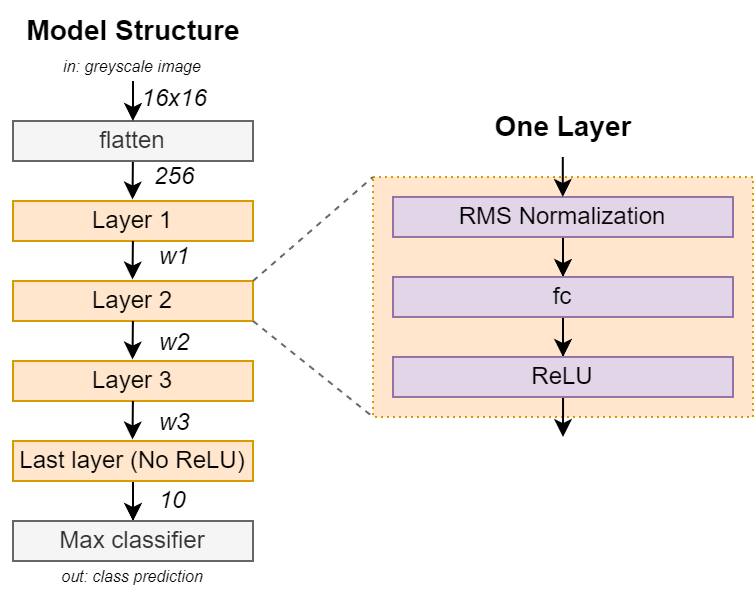
</div>

The sizes of the hidden layers are parametrizable. 

# Model Optimization

The MNIST dataset with standard train/test split was used. Unless noted otherwise, the model was trained with a batch size of 128 and initial learning rate of 0.01 for 30 Epochs. The learning rate was reduced by a factor of 0.1 after each 10 epochs. Adam optimizer was used and cross entropy loss function.

## Quantization Aware Training vs Post-Quantization

To investigate the efficacy of QAT, I trained the model with different bit-widths for weights and quantized it to the same or smaller bit-width before testing. I kept the network size at *w1=w2=w3=64* for all runs. 

<div align="center">
    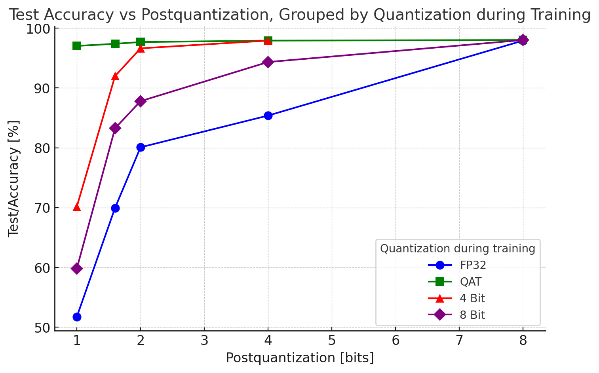
</div>

Around 98% accuracy is achieved with 8-bit quantized weights, whether trained with QAT or post-quantization. When a model is quantized to 4-bits or less after training, a significant drop in accuracy is observed. Quantization aware training can distribute the quantization error to other weights and achieves good accuracy even for one bit weights. 

Advanced post-quantization schemes as used in LLMs could improve post-quantization accuracy, but QAT is clearly the preferred approach for this use case.

### Model Capacity vs Quantization scaling

To deploy the model on a microcontroller, the model size should be kept as small as possible. The required memory footprint is proportional to the number of weights and the quantization level of the weights. To understand all tradeoffs I trained a large number of models with different widths and quantization levels, all using QAT. Typically, the width of all layers was kept the same. 

<div align="center">
    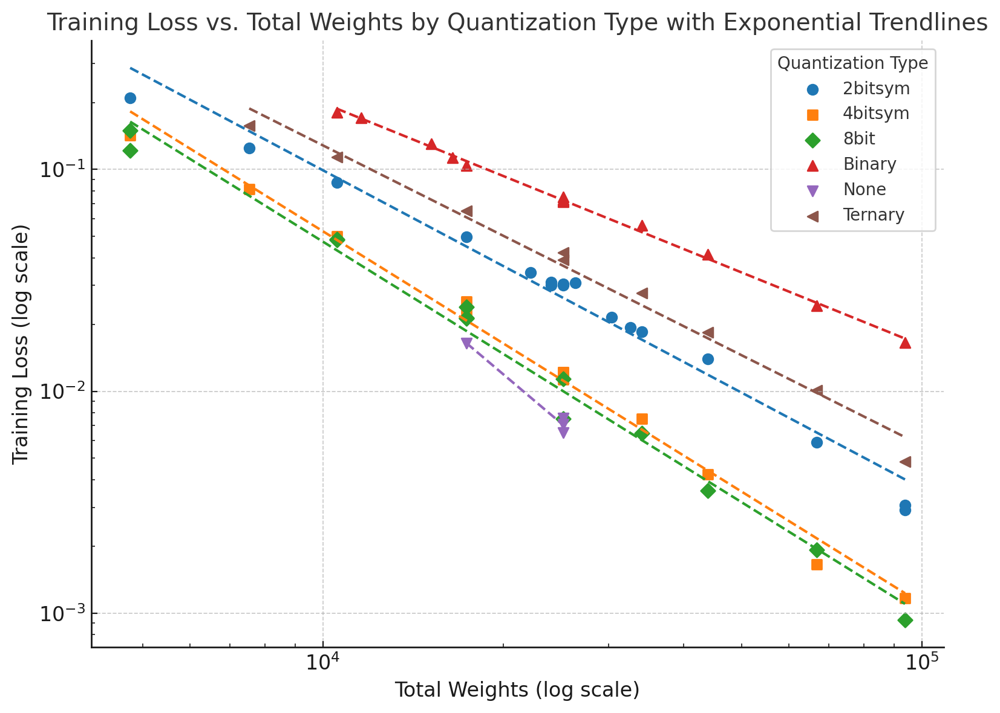
</div>

The plot above shows training loss vs. total number of weights. We can see that there is a polynomial relationship between the number of weights and the training loss. Reducing the number of bits per weight increases the loss proportionally. Interestingly, there are diminishing returns when increasing the number of bits beyond 4 and loss is not reduced further. It appears that beyond 4 bit, no more information per weight can be stored in the model. 

<div align="center">
    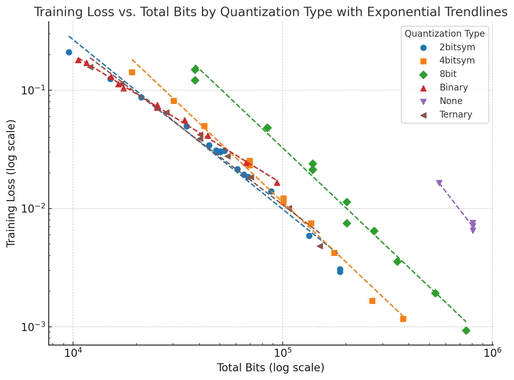
</div>

To understand which quantization level is the most memory efficient, I plotted the training loss vs. the total number of bits in the model. The number of bits is the product of the number of weights and the number of bits per weight. As can be seen in the plot above, the loss is proportional to the total number of bits, almost regardless of the quantization level between 1 and 4 bits. 

This trend seems to indicate that it is possible to trade bits per weight for an increased number of weights. Assuming that the training loss is indicative of the density of information stored in the model, this indicates that each bit carries the same amount of information, regardless of whether it is spent on increasing quantization levels or introducing more weights. 

```<rant>``` I am really intrigued by this result. Although this scaling relationship intuitively makes sense, I was not able to find much information about it. It raises the question of how to maximize information storage in the neural network. A cursory analysis of the weights according to Shannon information entropy suggests that it is near capacity for QAT, indicating that all weight encodings are used equally often. However, I also found that post-quantization of 4 bits can achieve the same loss with a weight encoding that follows a more normal distribution and therefore has lower entropy. If the entropy of the weights is not maximized, it means there could be on-the-fly compression to improve memory footprint. There are plenty of interesting things to come back to for later investigation.```</rant>```

Practically, this scaling relationship means that the number of bits per weight between 1-4 is a free variable that can be chosen depending on other requirements, such as compute requirements for inference.

### Test Accuracy and Loss

The scaling relationship above allows predicting train loss from model size. The plots below show the relationship between train and test loss and accuracy vs. model size.

<div align="center">
    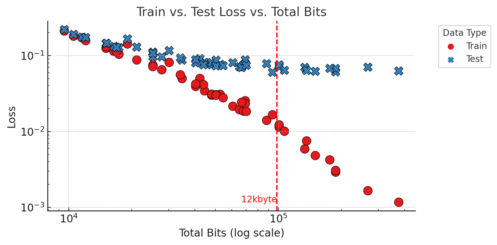
    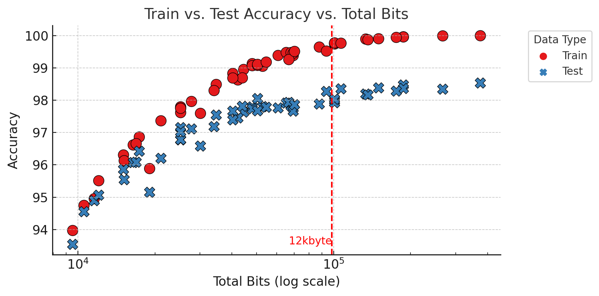
</div>

The tests above reveal a clear monotonic relationship between the model size and both test loss and accuracy, given the training setup used. However, there's a point of saturation where the test loss does not decrease any further. This could be indicative of overfitting, or it may suggest that the training data lacks sufficient variability to accurately represent the test data.

Considering the memory constraints of the target platform for inference, I've assumed that a maximum of 12kb of memory is available for the model. This is indicated by the red line in the plots above.

To improve model performance further, I fixed the model size to 12kb and explored various training parameters.

## Optimizing training parameters

The table below shows a set of network parameters that result in a model size close to 12 kbyte for various quantization levels. The number of weights in each layer was chosen to align parameter storage with int32. I tried to maintain the same width across all layers. 

<div align="center">

| Quantization [bit]  | 1 bit      | Ternary       | 2 bit       | 4 bit      | 8 bit       |
|---------------------|------------|---------------|-------------|------------|-------------|
| input               | 256        | 256           | 256         | 256        | 256         |
| w1                  | 176        | 128           | 112         | 64         | 40          |
| w2                  | 160        | 128           | 96          | 64         | 32          |
| w3                  | 160        | 112           | 96          | 64         | 32          |
| output                 | 10         | 10            | 10          | 10         | 10          |
| Number of weights   | 100416     | 64608         | 49600       | 25216      | 12864       |
| total bits [kbit]   | 100416     | 103372.8      | 99200       | 100864     | 102912      |

</div>

### Learning rate and number of epochs

I trained the models with different learning schedules and for a varying number of epochs. Switching from a linear to a cosine schedule resulted in a modest improvement, hence I kept this throughout the rest of the experiments.

<div style="text-align: center;">
    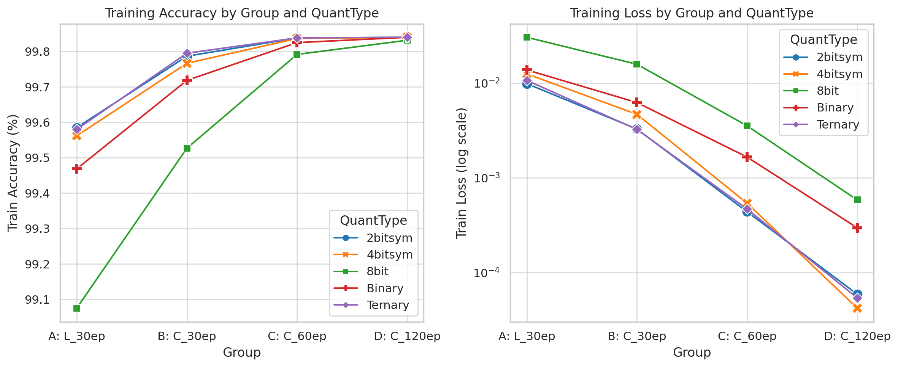
</div>

The training loss and accuracy is shown above. As expected from the experiments above, all models perform similarly. The 8bit quantized model has the higher loss, again. We can see that longer training reduces the loss and increases the accuracy.

<div align="center">
    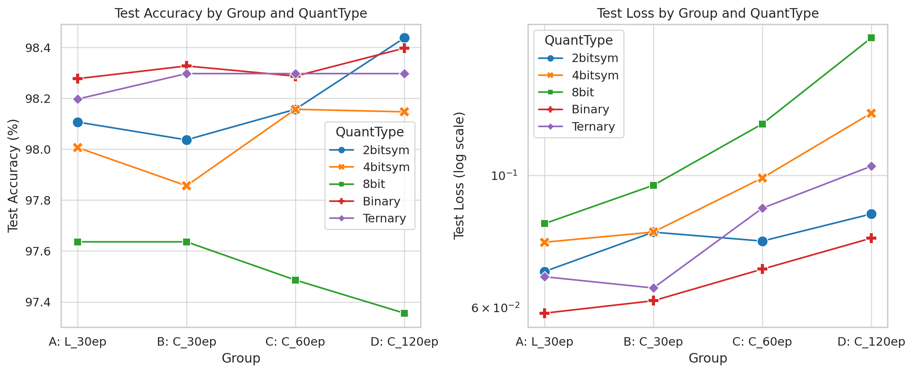
</div>

The test loss and accuracy, in contrast, does not show a significant improvement with longer training. The test loss increases with longer training time, suggesting overfit of the training data.

<p align="center">
    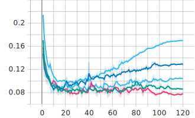
</p>

The test loss plot above for the 120 epoch runs clearly shows that the higher the number of bits per weight, the greater the increase in test loss. This dependence is somewhat surprising, as one might assume from the previous results that all models have the same capacity and therefore should exhibit similar overfitting behavior. It has been previously suggested that low bit quantization can have a regularizing effect on the network [^7]. This could explain the observed behavior.

However, despite the regularizing effect, the test accuracy does not exceed 98.4%, suggesting that the model is unable to generalize to all of the test data.

### Data Augmentation

To improve the generalization of the model, and counter the overfitting, I applied data augmentation to the training data. Randomized affine transformations were used to add a second set of training images to the unaltered MNIST dataset. In each epoch, the standard set of 60000 training images plus 60000 images with randomized transformations were used for training.

```python
    augmented_transform = transforms.Compose([
        transforms.RandomRotation(degrees=10),  
        transforms.RandomAffine(degrees=10, translate=(0.1, 0.1), scale=(0.9, 1.1)),   
        transforms.Resize((16, 16)),  # Resize images to 16x16
        transforms.ToTensor(),
        transforms.Normalize((0.1307,), (0.3081,))
    ])
```	

<div align="center">
    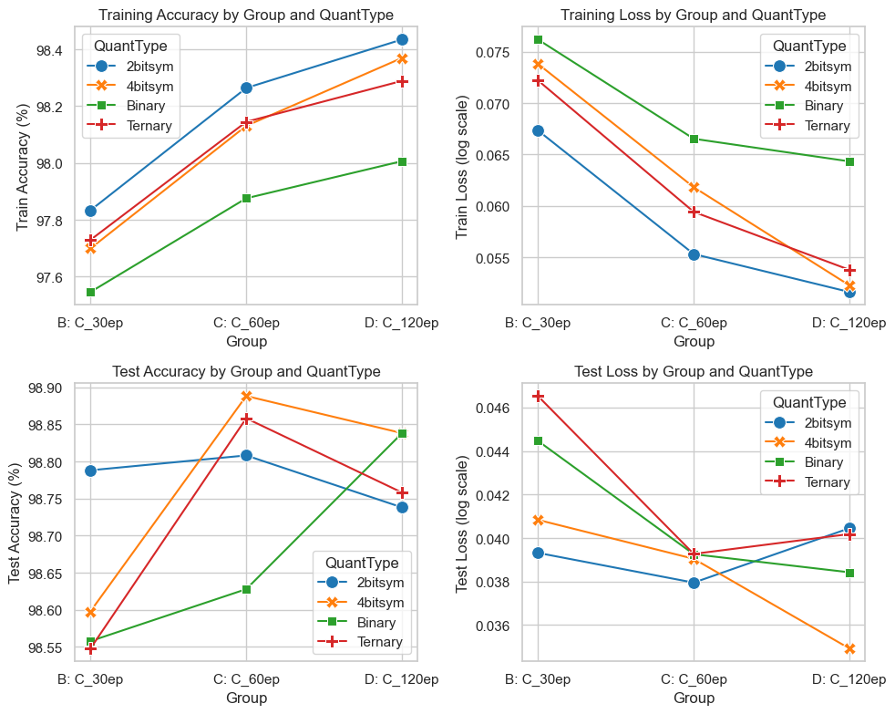
</div>

The loss and accuracy for different learning run epochs are displayed above. The training loss is higher than that observed without data augmentation, but the test accuracy also increases by more than 0.5%, approaches 98.9%. The test loss decreases with a higher number of epochs, suggesting that the model is not yet overfitting the data. This is further confirmed by the test loss plot below. Inserting dropout layers was also able to reduce overfitting, but I found that data augmentation was more effective in improving the test accuracy.

<p align="center">
    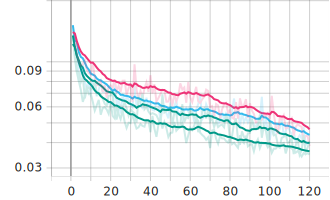
</p>

Interestingly, the test accuracy trend is now reversed, with higher bit quantization showing a slight advantage, despite identical total model sizes. The reason for this is not entirely clear.

<p align="center">
    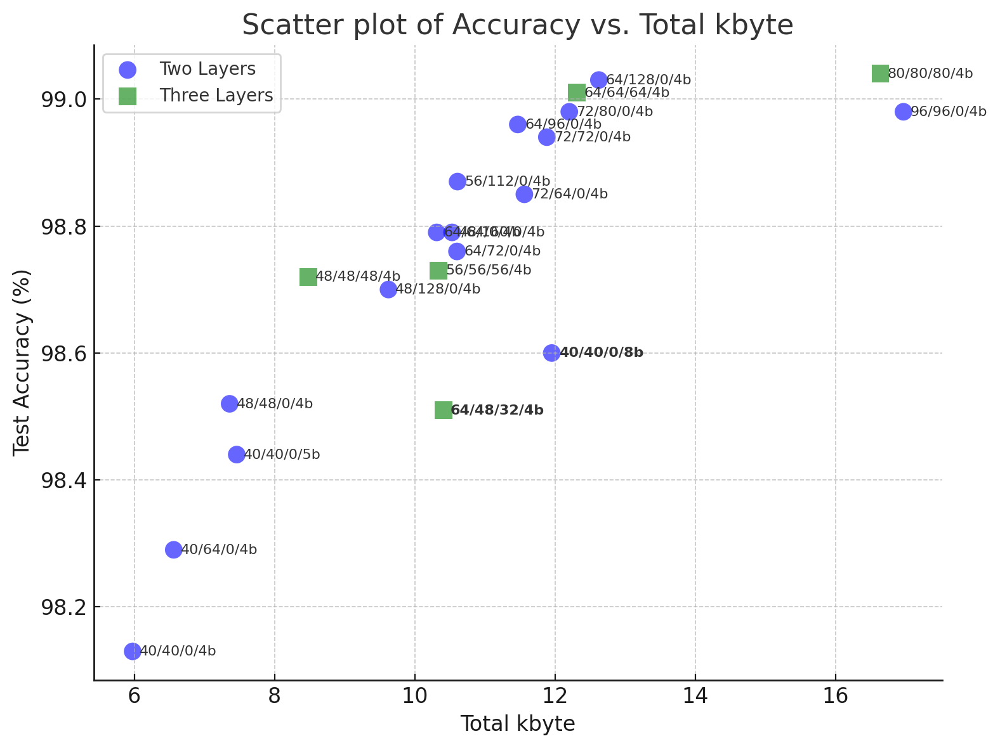
</p>

The plot above shows further model structure exploration with fine-tuned data-augmentation and 60 epochs. Notably, the monotonic relationship between test accuracy and model size is even maintained when the depth is reduced from 4 layers to 3 layers. The labels show the widths of the hidden activation layers and the quantization level.

There are two exceptions, labels highlighted in bold:

1. The 8-bit quantization deviates from the trend, even with extended training. Judging from the gap to the trend, it appears that between 5 and 6 bits of the 8-bit parameters are effectively used.

2. The structure with a tapered width (64/48/32/4b) seems to introduce a bottleneck that reduces accuracy.


I was able to achieve >99% accuracy with 4-bit quantization after slightly tweaking the data augmentation parameters. The best trade-off appears to be the 64/64/64/4b structure. Further improvements might require a different model architecture, such as a CNN. However, to keep things simple, I will stop here. 99.0% accuracy already surpasses most (if not all) other MNIST inference implementations I have seen on low-end MCUs such as AVR.

## Summary of Learnings from Training
 
* Quantization Aware Training (QAT) enables high-accuracy models with low-bit quantization.
* Between 1 and 4-bit quantization, it was possible to trade the number of bits per weight for more weights without a significant impact on accuracy and loss. 
* 8-bit quantization was less efficient in terms of memory efficiency.
* Lower bit quantization can have a regularizing effect on the network, leading to less overfitting.
* When overfitting was addressed with data augmentation, higher bit quantization showed increasingly improved accuracy.
* No specific benefit of ternary encoding over symmetric 2 or 4-bit encoding was observed.
* Considering all the trade-offs above, it appears that 4-bit quantization is the most preferable option for the problem at hand, as it offered the best performance and required the least number of weights, reducing computational effort.
* 99.0% accuracy was achieved with 4-bit quantization and data augmentation. 

## Addendum: Visualization of First Layer Weights

I visualized the weights of the first layer of the model trained with data augmentation. There are 16x16 input channels and 64 output channels. We can see that each channel detects certain structured features of the full input image.

<p align="center">
    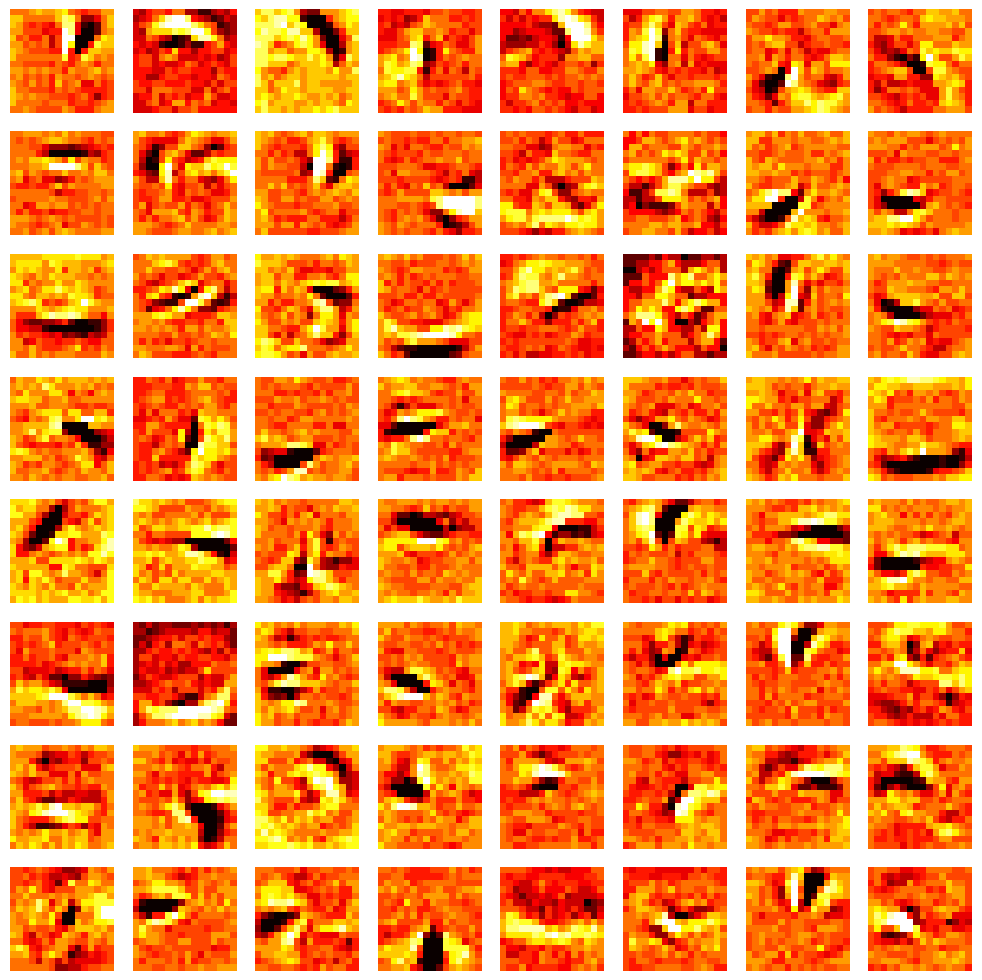
</p>

In contrast, the visualization below represents the first layer weights of the model trained without data augmentation. The weights seem less structured and appear more random. Instead of learning general features, the network seems to tend to fit directly to the images, as suggested by the discernible shapes of numbers.

<p align="center">
    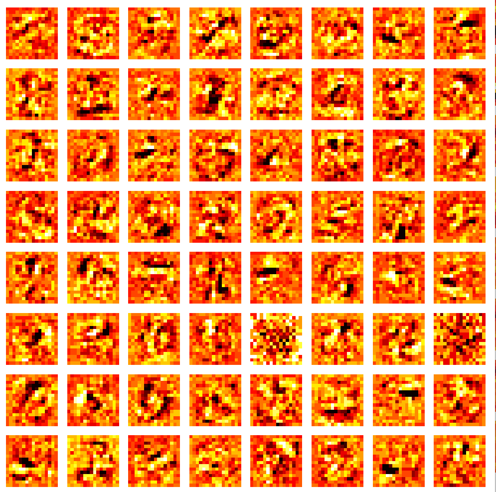
</p>

## Addendum: Potential of Additional CNN layers

Convolutional Neural Networks (CNNs) are typically preferred for image processing over fully connected networks due to their better performance. However, their implementation is more complex, which is why they were not included in this exploratory project.

The weights of a CNN are exposed to many different features within the same image, enabling them to learn generalized features much more effectively. This makes them more robust against overfitting and reduces the need for data augmentation. Additionally, they trade higher computational effort for a smaller memory footprint, as the weights are shared across the image.

To explore the potential of adding CNN layers, I added two 3x3 Conv2D layers to the model. The Conv2d layers were trained in float, while the fc layers were trained with 4-bit QAT. The model was trained with the same parameters as before (w1=w2=w3=64, augmentation, 60epochs).

```python 
    self.conv1 = nn.Conv2d(1, 16, kernel_size=3, stride=1, padding=1, bias=False)
    self.conv2 = nn.Conv2d(16, 16, kernel_size=3, stride=1, padding=1, bias=False)
...
    x = F.relu(self.conv1(x))
    x = F.max_pool2d(x, kernel_size=2, stride=2)
    x = F.relu(self.conv2(x))        
    x = F.max_pool2d(x, kernel_size=2, stride=2)
```

This modification increased the test accuracy to over 99%. Memory-efficient depthwise convolution with similar parameters yielded comparable results. Another topic to follow up opon later...

# Architecture of the Inference Engine

Since the training is performed on the model in float format (the weights are only quantized during forward and backward pass), the model needs to be converted to a quantized format and then exported to a format that can be included into the inference code on the CH32V003.

Let's first start with the target architecture. To reduce computational effort on the microcontroller as much as possible, I modified the network architecture implementation.

Key observations:

- No normalization is needed for the first layer as the input data (test sample) is already normalized.
- The fully connected layer accepts 8 bit signed integers, but as a result of the summation of partial products, the output is 32 bit.
- The normalization operation rescales the output back to an 8-bit value, but can only do this once all activations from the previous layer are available.
- Classification is performed by selecting the maximum value from the output layer and returning the index, which needs to be done before the ReLU operation.

These requirements can be met by the network architecture below. Each layer consists of a fully connected layer, followed by a fused block where normalization and ReLU are combined. Classification (maxpos) is performed before the ReLU operation in the same block, but the result is only used for the output layer.

<div align="center">
    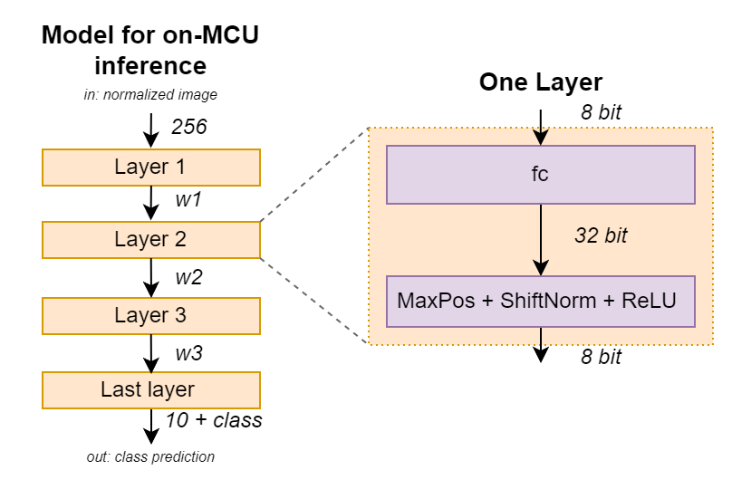
</div>
 
One crucial observation for further optimization of the inference engine:

<p align="center">
<strong>The model is tolerant to scaling errors as it doesn't employ any operations, other than ReLU, that alter the mean or linearity.</strong>
</p>

This is true because RMS norm is used as opposed to batch or layer norm, which prevents altering the mean of the activations. Additionally, no bias was used. While ReLU sets negative values to zero, it maintains the linearity of positive values.

This allows for a simpler normalization scheme to replace the RMS norm. I discovered that a simple shift operation, **ShiftNorm**, could be used instead. This operation shifts all output values in the layer until the maximum is less than 127 (int8_t). While this introduces some quantization noise, they I found it inconsequential in testing.

Ultimately, this means that no multiplication operation is required outside of the fully connected layer!

## Implementation in Ansi-C

### fc-layer

The code for a convolution with binary weights is straightforward:

```c
    int32_t sum = 0;
    for (uint32_t k = 0; k < n_input; k+=32) {
        uint32_t weightChunk = *weightidx++;

        for (uint32_t j = 0; j < 32; j++) {
            int32_t in=*activations_idx++;
            sum += (weightChunk & 0x80000000) ? in : -in; 
            weightChunk <<= 1;
        }
    }
    output[i] = sum;
```

This is how the inner loop looks in RV32EC assembly (compiled with -O3)

```asm
<processfclayer+0x28>
     1d8:	0785                addi	a5,a5,1
     1da:	fff78303          	lb	    t1,-1(a5) # ffff <_data_lma+0xc6db>
     1de:	02074563          	bltz	a4,208    <processfclayer+0x58>
     1e2:	0706                slli	a4,a4,0x1
     1e4:	40660633          	sub	    a2,a2,t1
     1e8:	fe5798e3          	bne	    a5,t0,1d8 <processfclayer+0x28>
    ...
<processfclayer+0x58>
     208:	0706                slli	a4,a4,0x1
     20a:	961a                add	    a2,a2,t1
     20c:	fc5796e3          	bne	    a5,t0,1d8 <processfclayer+0x28>    
```

The full loop is 6 instructions while the actual computation is just 3 instructions (lb, bltz,neg/add). The compiler did quite a good job to split the conditional into two code paths to avoid an addition "neg" instruction. 

It would be possible to unroll the loop to remove loop overhead. In that case 4 instructions are required per weight, since the trick with two codes paths would not work easily anymore.

Convolution with 4 bit weight is shown below. The multiplication is implemented by individual bit test and shift, as the MCU does not support a native multiplication instruction. The encoding as one-complement number without zero helps with code efficiency. 

```c
    int32_t sum = 0;
    for (uint32_t k = 0; k < n_input; k+=8) {
        uint32_t weightChunk = *weightidx++;

        for (uint32_t j = 0; j < 8; j++) {
            int32_t in=*activations_idx++;
            int32_t tmpsum = (weightChunk & 0x80000000) ? -in : in; 
            sum += tmpsum;                                  // sign*in*1
            if (weightChunk & 0x40000000) sum += tmpsum<<3; // sign*in*8
            if (weightChunk & 0x20000000) sum += tmpsum<<2; // sign*in*4
            if (weightChunk & 0x10000000) sum += tmpsum<<1; // sign*in*2
            weightChunk <<= 4;
        }
    }
    output[i] = sum;
```
Again, the compiled code of the inner loop below. The compiler decided to unroll the loop (8x), which removed the loop overhead.

```asm
     1d2:	00060383          	lb	    t2,0(a2)
     1d6:	00075463          	bgez	a4,1de <processfclayer+0x2e>
     1da:	407003b3          	neg	    t2,t2
<processfclayer+0x2e>     
     1de:	00371413          	slli	s0,a4,0x3
     1e2:	979e               	add	    a5,a5,t2
     1e4:	00045563          	bgez	s0,1ee <processfclayer+0x3e>
     1e8:	00139413          	slli	s0,t2,0x1
     1ec:	97a2               	add	    a5,a5,s0
<processfclayer+0x3e>    
     1ee:	00271413          	slli	s0,a4,0x2
     1f2:	00045563          	bgez	s0,1fc <processfclayer+0x4c>
     1f6:	00239413          	slli	s0,t2,0x2
     1fa:	97a2               	add	    a5,a5,s0
<processfclayer+0x4c>     
     1fc:	00171413          	slli	s0,a4,0x1
     200:	00045463          	bgez	s0,208 <processfclayer+0x58>
     204:	038e               	slli	t2,t2,0x3
     206:	979e               	add	    a5,a5,t2
<processfclayer+0x58>     
     208:	00471413          	slli	s0,a4,0x4
```

In total 17 instructions are required per weight, with no additional loop overhead. 

Considering the observations during model optimization, binary weights require approximately four times as many weights as 4-bit quantization to achieve the same performance. The execution time for binary inference is `4 cycles * 4 * number of weights`, while for 4-bit quantization, it's `17 cycles * number of weights`.

Consequently, the pure computation time is comparable for both quantization levels, offering no inference time advantage for binary weights for the given problem setting. In fact, due to the additional overhead from the increased number of activations required with binary weights, the total execution time is likely higher for binary weights.

The implementation for 2 bit quantization is not shown here, but it is similar to the 4 bit quantization. I did not implement Ternary weights due to complexity of encoding the weights in a compact way.

It should be noted, that the execution time can be improved by skipping zero activations. Typically, more than half of the activations are zero.

### ShiftNorm / ReLU block

The fused MaxPos / ShiftNorm / ReLU block is straightforward to implement. 

```c
    // Find the maximum value in the input array
    for (uint32_t i = 0; i < n_input; i++) {
        if (input[i] > max_val) {
            max_val = input[i];
            max_pos = i;
        }
    }

    // Find shift value to normalize the maximum value to <127 
    tmp=max_val>>7; 
    scale=0;

    while (tmp>0) {
        scale++;
        tmp>>=1;
    }

    // Apply ReLU activation and normalize to 8-bit
    for (uint32_t i = 0; i < n_input; i++) {
        if (input[i] < 0) {
            output[i] = 0;
        } else {
            output[i]=input[i] >> scale;  
        }    
    }
    return max_pos;
```
And that's all - **not a single multiplication operation was required**. 

# Putting it all together 

To keep things flexible, I split up the data pipeline into several python scripts. **training.py** is used to train the model and store it as *.pth* file. The model weights are still in float format at that time, since they are quantized on-the-fly during training. **exportquant.py** converts the model into a quantized format, a custom python class, that is only used as an intermediate representation for export and testing. The quantized model data is then merged into 32 bit integers and exported to a C header file. 

To test inference of the actual model as a C-implementation, the inference code along with the model data is compiled into a DLL. **test-inference.py** calls the DLL and compares the results with the original python model test case by test case. This allows accurate comparison to the entire MNIST test data set of 10000 images. 

The flow is shown in the figure below.

<div align="center">
    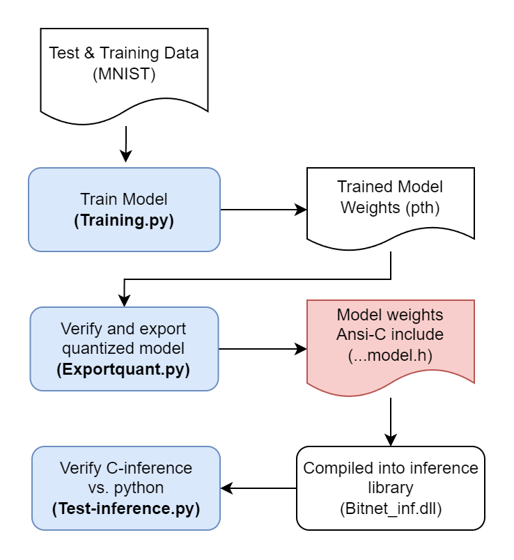
</div>

## Model Exporting

Output of the exporting tool is shown below. Some statistics on parameter usage are printed. We can see that the model is using all available codes, but they are not evenly distributed. This means that the model could be compressed further and that the entropy is not maximized.  

```
Inference using the original model...
Accuracy/Test of trained model: 98.98 %
Quantizing model...

Layer: 1, Max: 7.5, Min: -7.5, Mean: -0.00360107421875, Std: 2.544043042288096
Values: [-7.5 -6.5 -5.5 -4.5 -3.5 -2.5 -1.5 -0.5  0.5  1.5  2.5  3.5  4.5  5.5 6.5  7.5]
Percent: [ 2.47192383  0.73242188  0.8972168   1.59301758  3.08227539  6.68334961 12.83569336 20.71533203 20.86181641 13.9831543   7.36083984  3.47900391 2.12402344  1.21459961  0.81176758  1.15356445]
Entropy: 3.25 bits. Code capacity used: 81.16177579491874 %

Layer: 2, Max: 7.5, Min: -7.5, Mean: -0.12158203125, Std: 2.5687543790088463
Values: [-7.5 -6.5 -5.5 -4.5 -3.5 -2.5 -1.5 -0.5  0.5  1.5  2.5  3.5  4.5  5.5 6.5  7.5]
Percent: [ 1.171875    0.95214844  1.53808594  3.56445312  5.54199219  8.71582031 12.25585938 16.38183594 16.50390625 13.50097656 10.05859375  5.56640625 2.41699219  1.09863281  0.46386719  0.26855469]
Entropy: 3.38 bits. Code capacity used: 84.61113322636102 %

Layer: 3, Max: 6.5, Min: -7.5, Mean: -0.23291015625, Std: 2.508764116126823
Values: [-7.5 -6.5 -5.5 -4.5 -3.5 -2.5 -1.5 -0.5  0.5  1.5  2.5  3.5  4.5  5.5 6.5]
Percent: [ 0.78125     0.9765625   1.92871094  4.05273438  5.71289062 10.08300781 12.93945312 14.23339844 16.33300781 14.23339844  9.91210938  5.59082031 2.34375     0.63476562  0.24414062]
Entropy: 3.35 bits. Code capacity used: 83.84599479239081 %

Layer: 4, Max: 4.5, Min: -7.5, Mean: -0.73125, Std: 2.269283683786582
Values: [-7.5 -5.5 -4.5 -3.5 -2.5 -1.5 -0.5  0.5  1.5  2.5  3.5  4.5]
Percent: [ 0.15625  0.78125  4.0625  12.96875 15.3125  15.625   14.6875  11.25 9.53125 10.46875  4.21875  0.9375 ]
Entropy: 3.15 bits. Code capacity used: 78.82800031261552 %
Total number of bits: 100864 (12.3125 kbytes)
inference of quantized model
Accuracy/Test of quantized model: 99.00999999999999 %
```

The total size of the model is 12.3 kilobytes. The tool also performs inference on both the original PyTorch model and a quantized version that emulates the ShiftNorm operation. Interestingly, the accuracy of the quantized model is 99.01%, which is slightly better than the original model. The model data is written to a header file, which is subsequently included in the C code.

```c
const uint32_t L2_weights[] = {0x1231aa2, 0x29c09a90, 0x20a16b50, 0x8c938109, 0x320a2301, 0x2810008, 0x89114a9a, 0x9fb1c101, 0x899c90, 0x2889329, 0xab0b9bcc, 0x9a419319, 0x8209091a, 0x2b8da0b9, 0x282144a0, 0x3fb8881, ...
```

## Verification of the Ansi-C Inference Engine vs. Python

The exported data and the inference engine are compiled to DLL, which is then called from the python test script and compares the predictions image- by image.

The output is shown below. Curiously, the C inference engine is yet again slightly better than the Python implementation. There are still three (out of 10000) test images where both engine disagree. I believe this is due to different rounding behavior of the two engines. I was already able to reduce this from a larger number by adding additional rounding to the ShiftNorm operation. 

```
Loading model...
Inference using the original model...
Accuracy/Test of trained model: 98.98 %
Quantizing model...
Total number of bits: 100864 (12.3125 kbytes)
Verifying inference of quantized model in Python and C
Mismatch between inference engines. Prediction C: 6 Prediction Python: 4 True: 4
Mismatch between inference engines. Prediction C: 5 Prediction Python: 0 True: 5
Mismatch between inference engines. Prediction C: 3 Prediction Python: 5 True: 3
size of test data: 10000
Mispredictions C: 98 Py: 99
Overall accuracy C: 99.02 %
Overall accuracy Python: 99.00999999999999 %
Mismatches between engines: 3 (0.03%)
```
## Implementation on the CH32V003

The implementation on the CH32V003 is straightforward and can be found [here](https://github.com/cpldcpu/BitNetMCU/tree/main/mcu). The model data is included in the C code, and the inference engine is called from the main loop. I used the excellent [CH32V003fun](https://github.com/cnlohr/ch32v003fun) environment to minimize overhead code as much as possible. This allowed me to include up to 12KB of model data into the 16KB of flash memory.  The execution timing was optimized by moving the fc-layer code to the SRAM, which avoids flash wait states. Further optimizations on assembler level will certainly improve the performance further, but the generated code was already quite good.

<div align="center">
    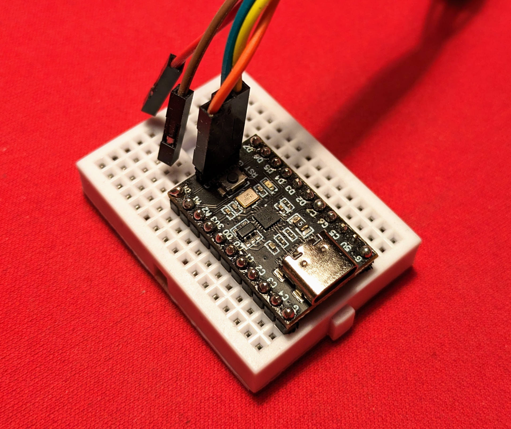
</div>

Four test cases are evaluated, and the execution timing is measured using the internal SysTick profiling timer. The results are printed to the debug-console using printf.

Example output for inference with a 25126 4-bit parameter model is shown below.

<div align="center">
    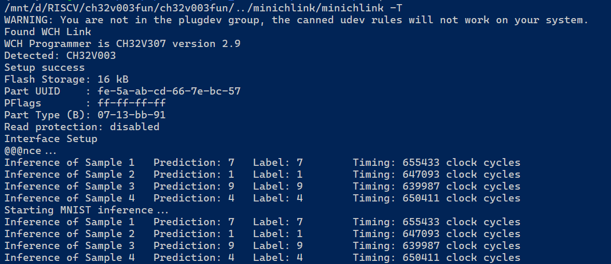
</div>

The execution time is approximately 650,000 cycles, which corresponds to 13.66ms at a 48MHz main clock. This is equivalent to 3.69 million operations per second ("MOPS"). The model achieves a test accuracy of 99.02%, which is quite impressive for such a small microcontroller and surpasses all other MCU-based MNIST implementations I have encountered.

I also tested a smaller model with 4512 2-bit parameters. Despite its size, it still achieves a 94.22% test accuracy. Due to its lower computational requirements, it executes in only 1.88ms.

# Summary and Conclusions
This marks the end of my journey to implement an MNIST inference engine with an impressive 99.02% test accuracy on a very limited $0.15 RISC-V microcontroller, which lacks a multiplication instruction and has only 16KB of flash memory and 2KB of RAM.

This achievement was made possible by employing Quantization Aware Training (QAT) in connection with low-bit quantization and precise model capacity tuning. An interesting observation, which I had not seen so clearly elsewhere, is that at the capacity limit, it's feasible to trade the number of bits per weight for the number of weights. The inference accuracy could be predicted by the total number of bits used for the weights within certain limits. There was a slight improvement in performance when using 4-bit quantization over lower bit quantization. 8-bit quantization offered diminishing returns and only stored about 5 bits of equivalent information per weight.

By simplifying the model architecture and using a full-custom implementation, I bypassed the usual complexities and memory overhead associated with Edge-ML inference engines.

While this project focused on MNIST inference as a test case, I plan to apply this approach to other applications in the future.
# Updates
## May 20, 2024: Additional quantization schemes

This section outlines additional quantization schemes that improve inference speed to microcontrollers without and with multiplier. WCH has recently announced new members of the CH32V003 family that come with a slightly extended instruction set architecture, RV32EmC or officialle RV32EC-Zmmul, which also support multiplication. It is likely that the CH32V003 will remain the only multiplierless RISC-V MCU in the industry, hence supporting multiplications is a good idea.

### FP1.3.0 Quantization

FP1.3.0 or FP130 is a quantization scheme based on 4-bit floating point numbers with 1-bit sign, 3-bit exponent and 0-bit mantissa. Weights are encoded as follows: $w = \text{sign} \times 2^{\text{exponent}}$. This will provide us with weights as exponents of two without zero: ```-128, -64 ... -2, -1, 1, 2, ... 64, 128```

The implementation of the inference code in C is extremely effective as only shift operations are required:

```c
    for (uint32_t k = 0; k < n_input; k+=8) {
        uint32_t weightChunk = *weightidx++;
        for (uint32_t j = 0; j < 8; j++) {
            int32_t in=*activations_idx++;
            int32_t tmpsum;
            
            tmpsum = (weightChunk & 0x80000000) ? -in : in;  // sign 
            sum += tmpsum << ((weightChunk >> 28) & 7);      // sign*in*2^log                       
            weightChunk <<= 4;
        }
```

Accordingly, the code compiled to only a few instructions per weight, even on RV32EC.

```asm	
loop:
	01db08b3          	add	    a7,s6,t4

	00088883          	lb	    a7,0(a7)
	000f5463          	bgez	t5,20000168 <positive>
	411008b3          	neg	    a7,a7
positive:

	01cf5a93          	srli	s5,t5,0x1c
	007afa93          	andi	s5,s5,7
	015898b3          	sll	    a7,a7,s5
	9846               	add	    a6,a6,a7

	0e85               	addi	t4,t4,1
	0f12               	slli	t5,t5,0x4

	fdfe9fe3          	bne	    t4,t6,20000158 <loop>
```

Amazingly, Quantization Aware Training is able to adjust the weights in a way where this encoding can be used efficiently. A test accuracy of 98.66% was achieved with the same model size and training settings, which is only slightly lower than for ```4bitsym``` encoding. The inference time reduces to 10.17ms from 13.66ms due to the simpler shift operation.

This is quite remarkable as using shifts instead of multiplications also would reduce complexity (circuit size) on dedicated inference hardware significantly. There seems to be some research on similar quantization schemes[^8], but no broad adoption yet.

The first layer weights are shown below. Due to the increased contrast enforced by the exponential encoding, we can see stronger differences between patterns.

<div align="center">
    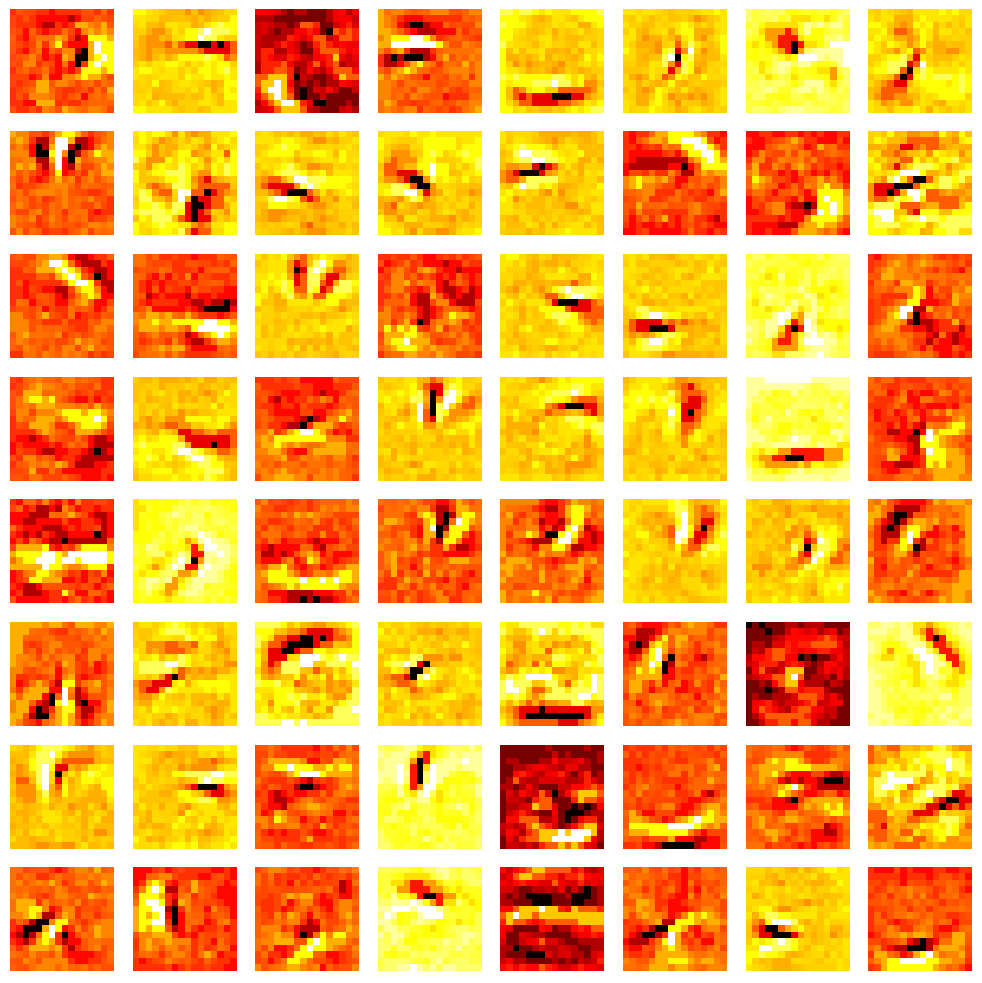
</div>

The entropy is comparable to other 4 bit encodings, suggesting similar effective use of the coding space. We can, however, see that the lower layers do not use all of the available codes, which could be optimized further but different normalization schemes.

<div align="center">
    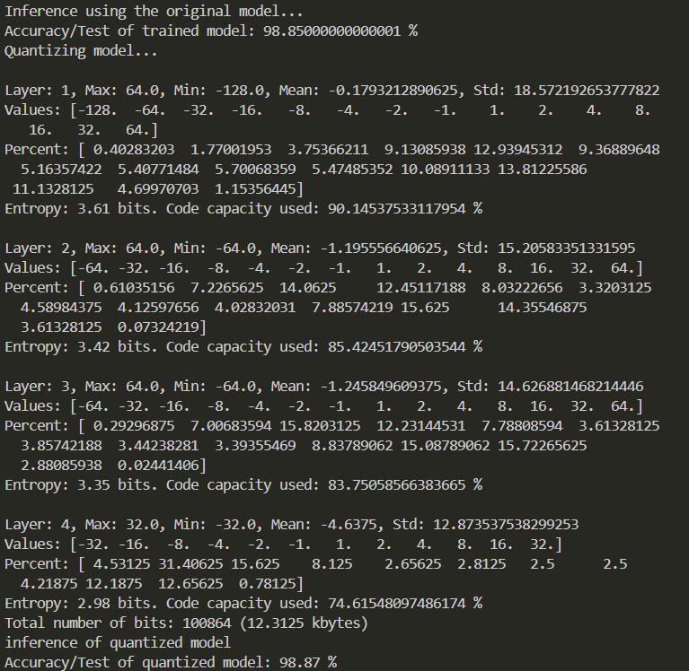
</div>


### 4-bit ones complement quantization

The current implementation of 4 bit quantization ```4bitsym``` uses a symmetric encoding without zero. This is easy to implement on multiplierless MCUs, but becomes unnecessarily complex when a multiplier is available. Therefore, I introduced ```4bit``` encoding, which encodes a 4 bit signed value is a one-complement number including zero: ```-8, -7 ... -2, -1, 0, 1, 2, ... 6, 7```.

This allows for a more efficient implementation of the inference code, given that the multiplication instruction is available:

```c
    for (uint32_t k = 0; k < n_input; k+=8) {
        int32_t weightChunk = *weightidx++;
        for (uint32_t j = 0; j < 8; j++) {
            int32_t in=*activations_idx++;
                            // extend sign, remove lower bits
            int32_t weight = (weightChunk) >> (32-4); 
            sum += in*weight;                                  
            weightChunk <<= 4;
        }
```

Compiles to the following, much shorter, assembly code: 

```
loop:
    	01ca8f33          	add	    t5,s5,t3
    	000f0f03          	lb	    t5,0(t5)

    	41cedb13          	srai	s6,t4,0x1c
    	036f0f33          	mul	    t5,t5,s6
    	987a                add	    a6,a6,t5

    	0e05                addi	t3,t3,1
    	0e92                slli	t4,t4,0x4

    	fffe15e3          	bne	    t3,t6,2000011e <loop>
```
## May 20, 2024: Quantization scaling

I introduced a new hyperparameter that was previously hardcoded: ```quantscale```. This parameters influences the scaling of the weights. It will determine the value of the standard-deviation of the weights per tensor relative to the maximum value of the quantization scheme. Previously, the parameter was set to a default of 0.25, which corresponds to a standard deviation of approximately 2 for the ```4bitsym``` encoding.

The plot below shows how the parameter influences the distribution of the first layer weights for the ```4bitsym``` encoding. 

<div align="center">
    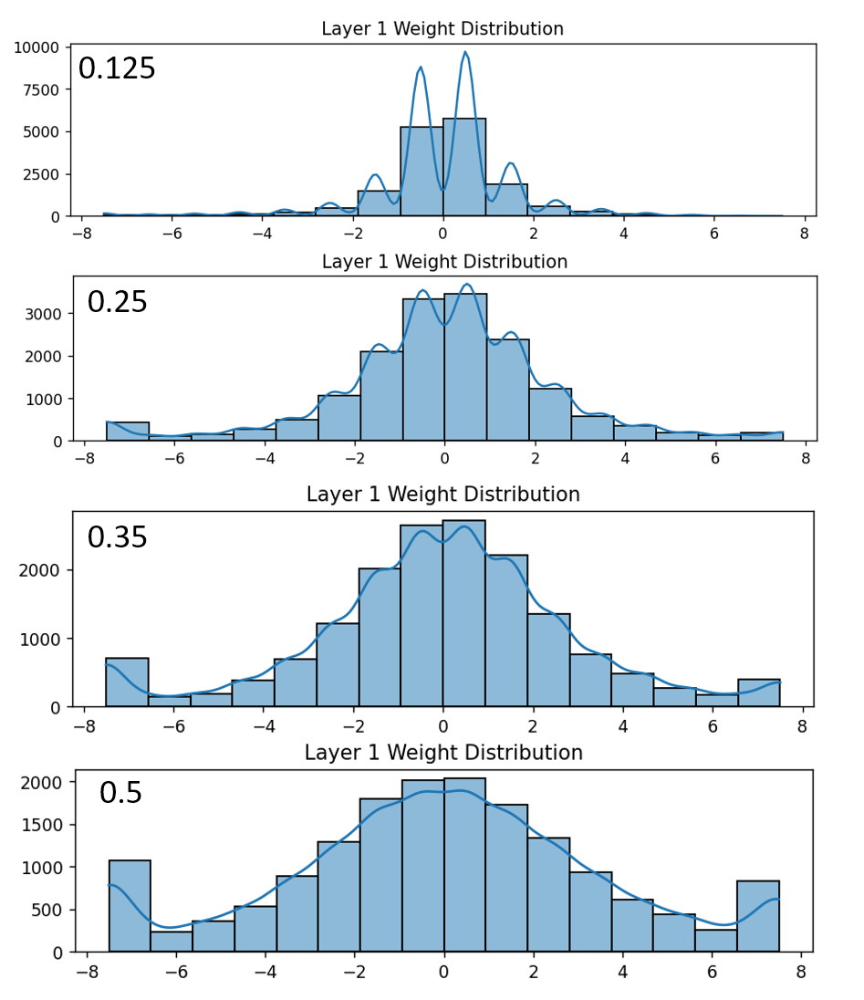
</div>

We can see that the weights follow roughly a normal distribution with some extreme outliers. Changing quantscale to a higher value with make the distribution wider and increase the fraction of outliers at the maxima. QAT makes sure that the errors introducing from clipping the outliers are distributed to other weights.

<div align="center">
    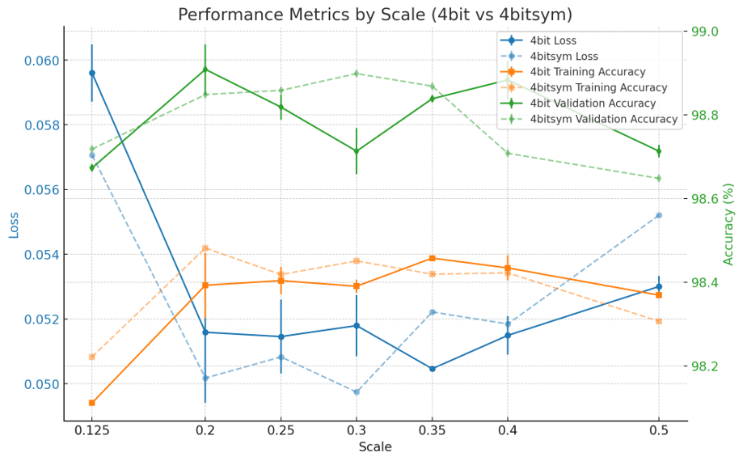
</div>

I performed a scan of the parameter for the ```4bitsym``` and ```4bit``` encoding. We see that too high (0.5) and too low (0.125) degrade the weight distribution, leading to an increase of loss and worse test and train accuracy. Within the range of 0.2 to 0.4, the performance seems to be relatively stable. However, there is still a strong random variation of accuracy, caused by different initializations of the weights. This is also owed to the marginal capacity of the model which was minimized as much as possible. 

<div align="center">
    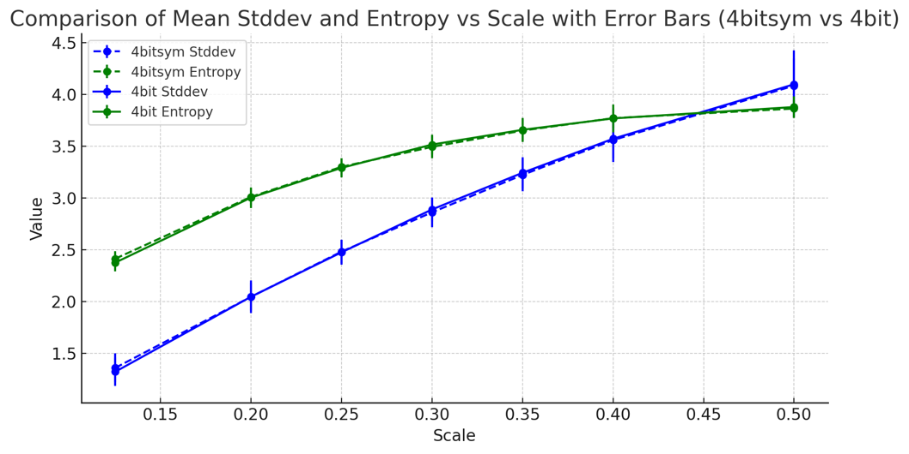
</div>

There is a rather interesting relationship when looking at standard deviation and [information entropy](https://en.wikipedia.org/wiki/Entropy_(information_theory)) across the layers. As expected, ```quantscale``` biases the standard deviation in a roughly proportional way. However, we can also see that the entropy increases for higher values. For low settings, this is because most weights are around zero and are truncated. Increasing the scale parameter also increases entropy. However, the accuracy of the model does not benefit, which means that only noise is added and no useful information. 

Already for an entropy of around 3 bits, it is possible to roughly maximize accuracy. This suggests that the weights can be compressed further to less than 80% of their original size, for example with an additional [entropy coding step](https://en.wikipedia.org/wiki/Entropy_coding), without loss of accuracy. Its an interesting question, whether this can also be achieved by different weight encoding.

## July 19, 2024: OCTAV Optimum Clipping

In the previous update I introduced a new hyperparameter to control the quantization step size and indirectly the clipping. It is, however, also possible to determine an optimum based on the given weight distribution. Such a method, called OCTAV, is presented a recent paper by Nvidia (Sakr et al. [^9]). I found it via [this talk ](https://www.youtube.com/watch?v=gofI47kfD28) by Bill Dally, which is a recommended watch.

The method introduces a clipping parameter `s` that determines the maximum encoded weight-value. Values with a magnitude larger than s will be clipped to s, values with a smaller magnitude are quantized according to the quantization step size. 

The octav algorithm determines the clipping parameter by minimizing the mean squared error `J(s)`between the original and quantized weights: Weight below s contribute to the error with quantization noise `(s*2*2^-bpw)²/12 = s²*4^-bpw / 3`, weight above s with the clipping error `(weight-s)²`. 

<div align="center">
    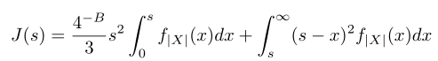
</div>

The clipping parameter `s` that minimizes the error can be determined by iteration with the newton method[^9]. The implementation resides in `BitNetMCU.py` and is also shown below.

```python	
for _ in range(num_iterations):
    indicator_le = (torch.abs(tensor) <= s).float()
    indicator_gt = (torch.abs(tensor) > s).float()
    numerator = torch.sum(torch.abs(tensor) * indicator_gt)
    denominator = (4**-self.bpw / 3) * torch.sum(indicator_le) + torch.sum(indicator_gt)
    s = numerator / denominator
```

The octav method is called after every training epoch to adjust the clipping parameter for each layer. The evolution of s and entropy per layer vs training epoch is shown below.

<div align="center">
    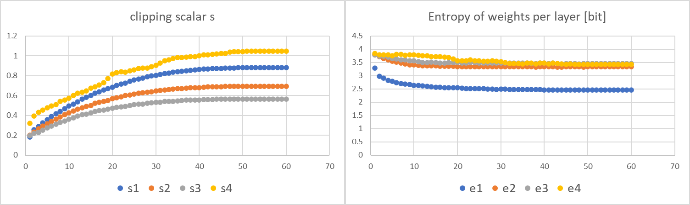
</div>

Compared to the empirical setting of `quantscale`, the octav method yielded a similar training loss. This means we can reduce the number of hyperparameters to tune.

It appears that octav minimizes the entropy of the weights, without affecting accuracy. This could be interpreted as reducing noise.

<div align="center">
    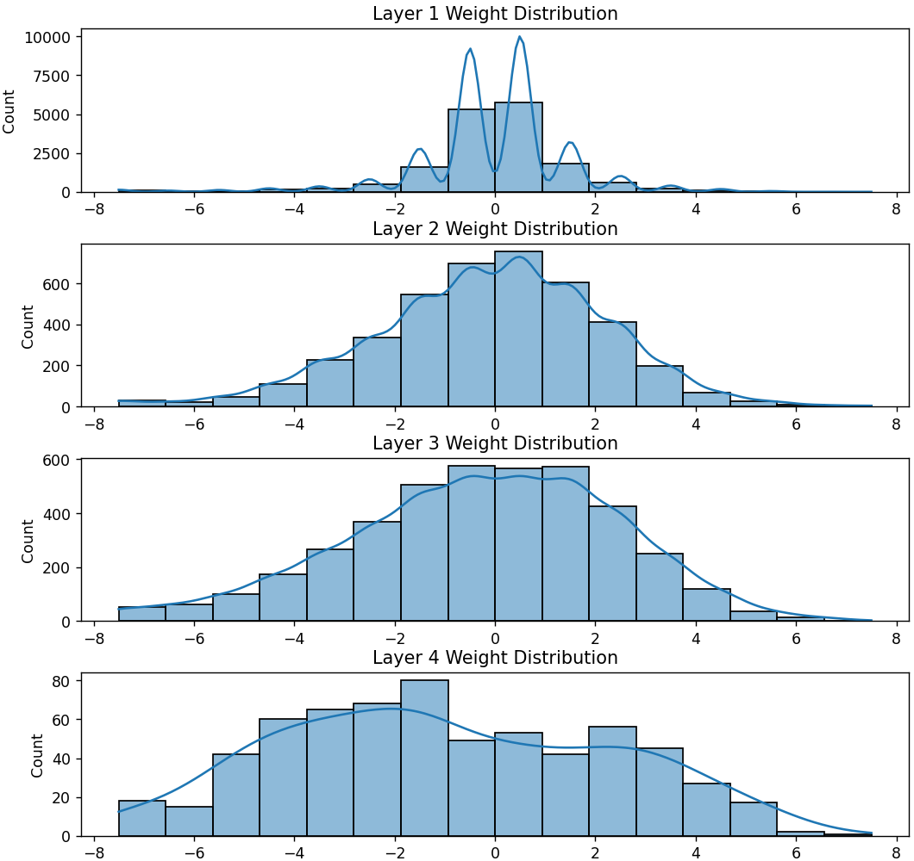
</div>

Looking at the distribution, it is curious that there are very few weights with clipped values at the extremes. 

## July 26, 2024: NormalFloat4 (NF4) Quantization

Normalfloat is a data type that was introduced in the QLoRa paper by T. Dettmers[^10]. The idea is to map 4-bit weights in a way where more values are available around zero, which is the most common value for weights. The data type is information-theoretically optimized for normally distributed weights.

<div align="center">
    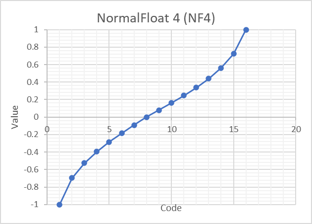
</div>

The plot above shows the weight encoding. Typically, this datatype is used for post-quantization, but it also makes sense for QAT, since the weight distribution follows a normal distribution as well.

To implement this datatype, it is necessary to quantize values according to an encoding table. The Python implementation (proposed by 3.5-Sonnet) is shown below. Frankly, I am quite impressed by the implementation, which hardly increased training time.

```python
    ...
    elif self.QuantType == 'NF4':
        # NF4 levels (16 levels for 4 bits)
        levels = torch.tensor([-1.0, -0.6962, -0.5251, -0.3949, -0.2844, -0.1848, -0.0911, 0.0, 
                                0.0796, 0.1609, 0.2461, 0.3379, 0.4407, 0.5626, 0.723, 1.0], device=w.device)
        u , _ = self.quantize_list(w * scale, levels)
    ...

    def quantize_list(self, x, levels):
    """
    Quantize the input tensor x to the nearest level in the levels list.
    """        
    # Compute the absolute difference between x and each level
    diff = torch.abs(x.unsqueeze(-1) - levels)
    # Find the index of the closest level for each element in x
    indices = torch.argmin(diff, dim=-1)

    return levels[indices], indices
```

Initial tests showed that `NF4` performed similarly to the linear 4-bit encoding `4bitsym`. To get a better assessment of the initial model capacity enabled by this datatype, I performed a scaling experiment where I varied the number of weights in the model by changing the width of the model in three steps (40, 48, 56). I intentionally kept the model size below capacity for MNIST (~64 width for the fc model) to avoid saturating the model capacity. I used short training runs (20 epochs) to save time.

<div align="center">
    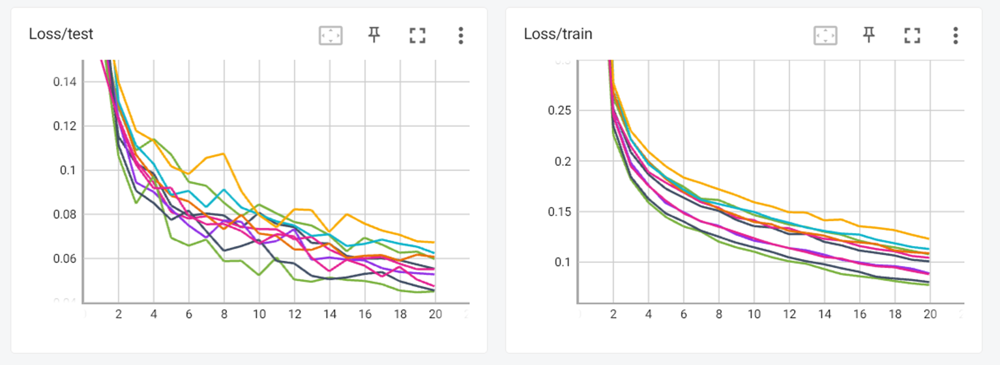
</div>

Similar to the network scaling experiment above, we can now plot training loss vs. model capacity. The plot below shows the results for three different quantization schemes: `NF4`, `4bitsym`, and `FP130`.

<div align="center">
    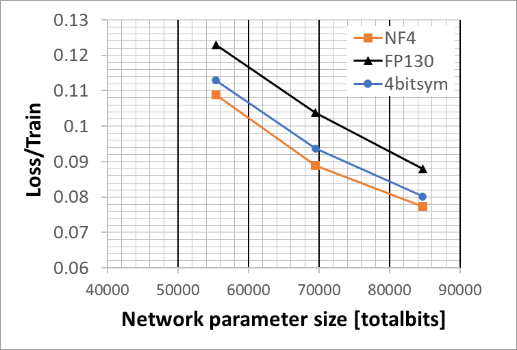
</div>

We see that the `NF4` encoding consistently leads to lower loss at the same network size than both `4bitsym` and `FP130`. `FP130` performs the worst, which is likely due to poor code use because of the exponential encoding.

To achieve the same loss, an `NF4` encoded model requires ~3% fewer parameters than `4bitsym`, while `FP130` requires ~10% more.

The benefit is rather small, most likely because quantization-aware training is generally very good at adapting to any quantization scheme.

I have not yet implemented C-based inference code for `NF4`; however, it would allow for efficient implementation with table lookups. For example, W4A4 would require a 256-entry table to multiply one weight with one activation, which is rather small. In that case, `NF4` encoding could also be used for activations.

# References

[^1]: S. Ma et al *The Era of 1-bit LLMs: All Large Language Models are in 1.58 Bits* ([arXiv:2402.17764](https://arxiv.org/abs/2402.17764)) and [discussion here](https://huggingface.co/papers/2402.17764) 

[^2]: A. Gholami et al. *A Survey of Quantization Methods for Efficient Neural Network Inference* ([arXiv:2103.13630](https://arxiv.org/abs/2103.13630))

[^3]: M. Rastegari et al. *XNOR-Net: ImageNet Classification Using Binary Convolutional Neural Networks* ([arXiv:1603.05279](https://arxiv.org/abs/1603.05279)) and *BinaryNet: Training Deep Neural Networks with Weights and Activations Constrained to +1 or -1* ([arXiv:1602.02830](https://arxiv.org/abs/1602.02830))

[^4]: S. Ma et al. *The-Era-of-1-bit-LLMs__Training_Tips_Code_FAQ* ([Github](https://github.com/microsoft/unilm/blob/master/bitnet/The-Era-of-1-bit-LLMs__Training_Tips_Code_FAQ.pdf))

[^5]: Y. Bengio et al. *Estimating or Propagating Gradients Through Stochastic Neurons for Conditional Computation* [arXiv:1308.3432](https://arxiv.org/abs/1308.3432)

[^6]: B. Zhang et al.  *Root Mean Square Layer Normalization* [arXiv:1910.07467](https://arxiv.org/abs/1910.07467)

[^7]: M. Courbariaux et al. *BinaryConnect: Training Deep Neural Networks with binary weights during propagations* [arXiv:1511.00363](https://arxiv.org/abs/1511.00363)

[^8]: M. Elhoushi et al. *DeepShift: Towards Multiplication-Less Neural Networks*  [arXiv:1905.13298](https://arxiv.org/abs/1905.13298)

[^9]: C. Sakr et al. *Optimal Clipping and Magnitude-aware Differentiation for Improved Quantization-aware Training* [arXiv:2206.06501](https://arxiv.org/abs/2206.06501)

[^10]: T. Dettmers et al. *QLoRA: Efficient Finetuning of Quantized LLMs* [[arXiv:2305.14314]](https://arxiv.org/pdf/2305.14314)
