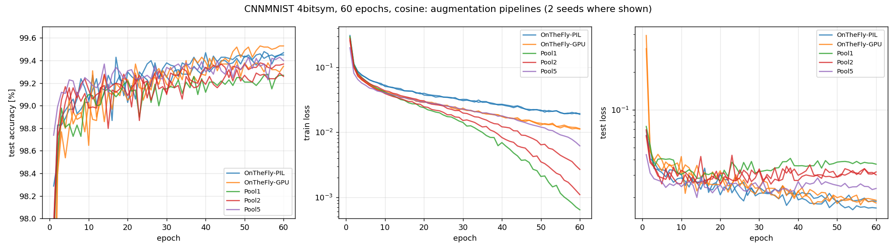
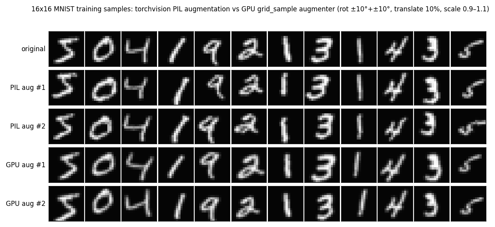
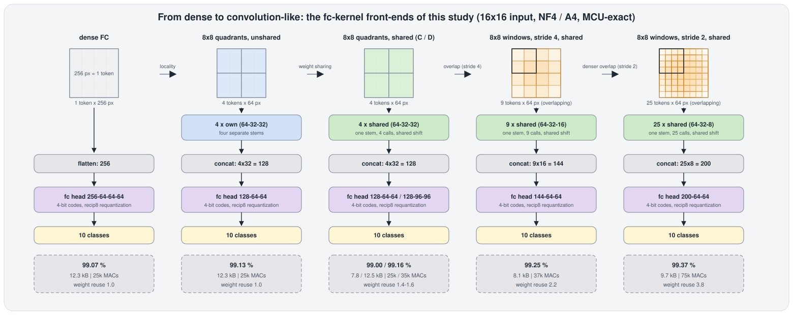
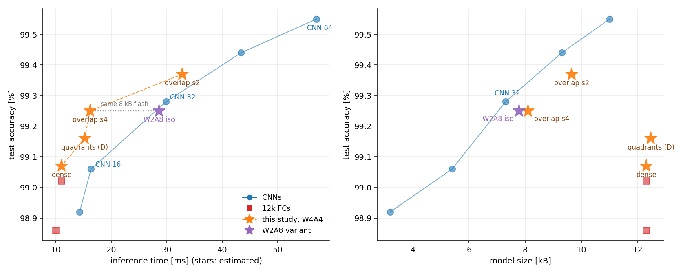

# BitNetMCU - Experiments 2026

**Further optimizations to BitNetMCU**

This continues the [original documentation](documentation.md) and the [CNN implementation log](documentation_cnn.md). Focus of the new investigations were to optimize the fc models further, with new Optimizer (Muon), activation aware training and optimized network architectures.

## Table of Contents
- [BitNetMCU - Experiments 2026](#bitnetmcu---experiments-2026)
  - [Table of Contents](#table-of-contents)
  - [September 2026 updates](#september-2026-updates)
  - [On-the-fly GPU based Augmentation](#on-the-fly-gpu-based-augmentation)
  - [Muon Optimizer](#muon-optimizer)
  - [Activation quantization](#activation-quantization)
    - [Table based multiplication, 4 bit activations and weights](#table-based-multiplication-4-bit-activations-and-weights)
    - [W4A4 vs W4A8 and NF4 vs. sINT4](#w4a4-vs-w4a8-and-nf4-vs-sint4)
  - [Optimized model architecture for dense models](#optimized-model-architecture-for-dense-models)
    - [Blockwise FC](#blockwise-fc)
    - [Overlapping Blockwise FC](#overlapping-blockwise-fc)
    - [bits per weight versus width at constant model storage](#bits-per-weight-versus-width-at-constant-model-storage)
  - [Overall comparison and next steps](#overall-comparison-and-next-steps)

## September 2026 updates

The availability on agentic AI made exploring new concepts and quickly iterating on them much easier. Hence I was able to explore some open ends which required tedious implementation.

## On-the-fly GPU based Augmentation

Data augmentation is key to achieving >98.5% accuracy on MNIST. My previous code used a CPU based on-the-fly data augmentation which was notoriously slow. I experimented with various GPU based approaches to speed this up. 

Since the dataset is rather small, it is easily possible to pre-compute augmented data batches. I found however, that even increasing the dataset size 5x still leads to overfitting, as evident in the training loss curve and the train accuracy.

Default CNN, 60 epochs per run:

| Pipeline | Runs | Final test accuracy | Train loss | Train accuracy |
|---|---:|---:|---:|---:|
| PIL, on the fly | 2 | 99.46 ± 0.01% | 0.0192 | 99.41% |
| GPU, bilinear, on the fly | 2 | 99.44 ± 0.09% | 0.0113 | 99.66% |
| GPU, nearest, on the fly | 2 | 99.45 ± 0.06% | 0.0161 | 99.50% |
| Pool1, 120k fixed images | 1 | 99.27% | 0.0006 | 100.00% |
| Pool2, 180k fixed images | 2 | 99.31 ± 0.06% | 0.0019 | 99.95% |
| Pool5, 360k fixed images | 1 | 99.40% | 0.0062 | 99.83% |

Notablily, the CPU based PIL on the gly augmentation still leads to the highest train loss, indicating that it adds more diversity to the training data than the other options. However, GPU on the fly augmentation with nearest pixel sampling instead of interpolation comes close and was used for the remaining experiments.

| Measurement on RTX 5090 | PIL, 4 loader workers | GPU augmenter | Reported speedup |
|---|---:|---:|---:|
| Generate 60k augmented samples | 9.3 s | 8 ms | About 1000× |
| CNN epoch, batch 64, 120k samples | 27.3 s | 17.4 s | 1.6× |
| FC 64-64-64 epoch, batch 128, 120k samples | 17.1 s | 6.2 s | 2.7× |

GPU based augmentation shaves around 10 seconds off the training time per epoch.

## Muon Optimizer

The [Muon optimizer](https://kellerjordan.github.io/posts/muon/) is a relatively new idea that only recently was shown to be [scalable to large models](https://arxiv.org/abs/2502.16982). My understanding is that Muon orthogonalizing the weight updates steps, effectively ensuring that also there is more diversity in the weights be using "all directions". This enforces a local structure on the weight updates, therefore it should not be applied to input and output layers that have to model distributions given by external constraints.

Ablation on FC 256→64→64→64→10, 4bitsym weights, A8, 60 epochs, fresh GPU augmentation, two runs per arm.

| FC optimizer | Final test accuracy | Train loss |
|---|---:|---:|
| Adam, lr 0.001 | 98.78 ± 0.00% | 0.0399 |
| Muon lr 0.02, Adam output layer | 98.94 ± 0.03% | 0.0340 |
| Muon lr 0.01, Adam output layer | **99.00 ± 0.01%** | 0.0336 |
| Muon lr 0.02 including output layer | 98.98 ± 0.06% | 0.0342 |
| Muon lr 0.01 including output layer | 98.89 ± 0.03% | 0.0317 |

The results are quite convincing and were exactly as advertized: Using Muon on the hidden layers improves the test accuracy quite significantly, +0.22% over Adam as used here. Most notable, the reproducibility is also excellent, while I usually had quite varied results with Adam before. Note that I also observed 99% with Adam before, but with more epochs and slightly different learning rate and augmentation.

| CNN optimizer, fresh GPU augmentation | Runs | Final test accuracy | Train loss |
|---|---:|---:|---:|
| Adam | 2 | 99.44 ± 0.09% | 0.0113 |
| Muon on all eligible matrices | 2 | 99.38 ± 0.03% | 0.0135 |
| Muon on FC matrices only | 1 | 99.38% | 0.0120 |

The CNN comparison shows no improvement from Muon, possibly since the fc layer in this model is not capacity-limited, or due to 2 bit quantization in the largest fc layer, which i found to have a strongly regularizting effect1. Since I focused on the FC models here, I did not explore Muon on CNNs further.

## Activation quantization

So far, I had not focussed on training with quantized activations. Using a 32 bit accumulator and 8 bit activations provided ample headroom to deal with the quantization error of activations and the shiftnorm rescaling. Typically a slight mismatch between integer and floating point inference was observed, but it did not affect overall accuracy.

[Kimstik suggested](https://github.com/cpldcpu/BitNetMCU/issues/2) some interesting approaches to parallelize MACs and there is also the option of using tables. All of these need bounded activations. So its worth looking into low bit activations as well.

### Table based multiplication, 4 bit activations and weights

Assuming we have 4 bit activations and also 4 bit weights (W4A4), we can precompute a table of all 16x16 multiplication results and simply perform a table lookup instead of a multiplication. On RV32EC (CH32V003) this is a bit faster than bit wise multiplication.

´´´c
for(int i=0; i<8; i++)
    {   
    sum+=multable[*activations++ | (weights&0xF)]
    weights >>= 4;
    }

´´´

A nice aspect of this approach is that we can integrate arbitrary encoding of the weights into the table. For example, [NF4 weights](https://github.com/cpldcpu/BitNetMCU/blob/main/docs/documentation.md#july-26-2024-normalfloat4-nf4-quantization) which try to model the distribution of the weights better than a simple linear quantization. The table is 256 bytes for linear encoding and 512 bytes for NF4 encoding.

A nice aspect in combination with ReLU activiation function is that we can only have positive output values. Hence the encoded range of activations after the first layer is 0-15. Since the input images are still 8 bit, it is necessary to process the first layer using 8 bit activations. With a table based approach this is easily possible by processing the upper and lower nibble separately.

One problem I encountered with 4 activations is that they are much more sensitive to the normalization scheme. Simply shifting all output values so that no value exceed 15 is not sufficient, as it underutilized the available range. 

The table below shows experiments with different normalization schemes (dense NF4/A4 FC, Muon lr 0.01 plus Adam head, nearest GPU augmentation, two runs per arm).

| Dense FC requantizer | 20-epoch final accuracy | 60-epoch final accuracy | Added arithmetic compared with a shift |
|---|---:|---:|---|
| Exact max, floating reference | 98.86 ± 0.00% | 98.99 ± 0.08% | Floating-scale reference |
| Shift, floor | 98.64 ± 0.04% | — | None |
| Shift, round | 98.78 ± 0.05% | 98.89 ± 0.17% | Rounding add |
| Max-derived 4-bit mantissa, floor | 98.72 ± 0.02% | 98.83 ± 0.04% | Small multiply and shift |
| Max-derived 4-bit mantissa, round | — | 98.94 ± 0.04% | Add, small multiply and shift |
| 8-bit reciprocal, floor | 98.91 ± 0.02% | **99.07 ± 0.04%** | Reciprocal per token, multiply per activation |
| 8-bit reciprocal, round | 98.91 ± 0.02% | **99.04 ± 0.04%** | Same, with rounding add |

For unsigned A4, the reported reciprocal rule is `s = floor(15 * 2^t / max_acc)`, with `t` selected for the desired significant-bit budget, followed by `(acc * s) >> t` or its rounded version.

As it turns out, the 8 bit reciprocal is the best approach. It does requires a multiplication with an 8 bit value per output, but this is outweighed by the simpler matrix multiplication.

### W4A4 vs W4A8 and NF4 vs. sINT4

The experiment below compares all combinations of NF4, sINT4 (-7 to 8) weight encoding and A4/A8 activations.  The models are using architectures with shared weights (C/D) as explained later. 60 epochs, two runs, integer training with reciprocal8 + round. 

| Weights / hidden activations | D: head 96, approximately 12.5 KiB | C: head 64, approximately 7.8 KiB | D train loss |
|---|---:|---:|---:|
| NF4 / A4 | 99.16 ± 0.01% | 99.00 ± 0.04% | 0.0256 |
| NF4 / A8 | 99.12 ± 0.01% | 99.01 ± 0.06% | 0.0234 |
| sINT4 / A4 | 99.04 ± 0.02% | 98.97 ± 0.07% | 0.0271 |
| sINT4 / A8 | **99.14 ± 0.03%** | **99.06 ± 0.01%** | 0.0233 |

What is notable is that NF4 achieves roughly the same accuracy for A4 and A8, while sINT4 degrades notably for A4. NF4/A4 is close to sINT4/A8. It appears that the slightly higher capacity of the NF4 weights allows to conter the degradtion observed for A4.

This is good news as it offers an avenue for post inference on CH32V003 without multiplier. However, when a multiplier is present, sINT4/A8 seems to be a better choice as it does not require accurate rounding with the 8 bit reciprocal.

## Optimized model architecture for dense models

One challenge when using fully connected models for image classification is that not all pixels have the same relevance. So a lot of weights are associated with pixel that prove not meaningful information. Furthermore, the model is not able to learn simple modifications to the image, like a translation, without it being in the training set. The generalization capability of fully connected models is therefore limited.

CNNs solve this by applying a set of filter to all pixels. This works very well, as we can see from the +0.5% gain in accuracy. However, a disadvantage is the more complex implementation and also an increase of processing time (MACs).

You can see an overview of the alternative architectures below.

    

### Blockwise FC

The idea behind blockwise FC is to apply a smaller fully connected layer only to a region of the image. In this case an 8x8 pixel quadrant. Either a different set of weights is used for each quadrant of the same weights are used for all quadrants. The rational behind this approach is that it will require fewer weight to translate the image pixel into latent features. Since each pixel is associated with fewer weights, less capacity is wasted on unimportant pixels.

The output of the blockwise fcs is then concatenated and processed by further layers.

Experimental results on NF4/A4, reciprocal8 + round, Muon lr 0.02 plus Adam head:

| Architecture, 60 epochs, exact-max training | Approx. weights | Final test accuracy |
|---|---:|---:|
| Dense 256→64→64→64→10, original phase-3 pair | 25.2k | 98.86 ± 0.06% |
| Shared 8 × 8 blocks, 64→32, head 64 | 15.0k | 98.99 ± 0.02% |
| Shared 8 × 8 blocks, 64→32, head 96 | 24.5k | 99.05 ± 0.02% |
| Polyphase control, shared 64→32, head 96 | 24.5k | 98.97 ± 0.02% |
| Shared 8 × 8 blocks, 64→32→32, head 64 (C) | 16.0k | 99.08 ± 0.01% |
| Shared 8 × 8 blocks, 64→32→32, head 96 (D) | 25.5k | **99.09 ± 0.03%** |
| Unshared 8 × 8 blocks, 64→32→32, head 64 | 25.2k | **99.14 ± 0.04%** |
| Unshared 8 × 8 blocks, 64→32, head 96 | 30.7k | 99.19 ± 0.05% |

This approaches worked quite well. We can see that it allows to break the 99% accuracy barrier with the same number of weights as the original dense model (25.2k). The added complexity in the inference code is quite small. However, we have to be careful to apply a normalization scheme that is compatible with the concatenation of the outputs of the blockwise fcs.

### Overlapping Blockwise FC

Blockwise processing addressed the dead pixel issue to some extend, but it does not improve generalization. As a simple extension, we can also apply overlapping blocks with stride 4 or stride 2. "Poor mans CNN". 

Experimental results on NF4/A4, reciprocal8 + round, Muon lr 0.02 plus Adam head:

| Window layout and shared stem | Head | Approx. weights | Weight KiB | Approx. MACs | Estimated time | Final test accuracy |
|---|---:|---:|---:|---:|---:|---:|
| 4 quadrants, 64→32→32 (C) | 64 | 16.0k | 7.8 | 25k | 11 ms | 99.00 ± 0.04% |
| 4 quadrants, 64→32→32 (D) | 96 | 25.5k | 12.5 | 35k | 15 ms | 99.16 ± 0.01% |
| 9 windows, stride 4, 64→32→32 | 64 | 26.2k | 12.8 | 51k | 22 ms | 99.22 ± 0.03% |
| 9 windows, stride 4, 64→32→16 | 64 | 16.5k | 8.1 | 37k | 16 ms | **99.25 ± 0.04%** |
| 25 windows, stride 2, 64→32→8 | 64 | 19.8k | 9.7 | 75k | 33 ms | **99.37 ± 0.03%** |

The results are quite impressive and are approaching the best accuracy achieved with CNNs, with the best model achieveing 99.37% with only 18.8k NF4 parameters - and, theoretically, multiplier free. 

### bits per weight versus width at constant model storage

I previously observed that up to 4 bits per weight, [the model capacity is roughly defined by the total number of bits in the model](https://github.com/cpldcpu/BitNetMCU/blob/main/docs/documentation.md#model-capacity-vs-quantization-scaling). Beyond 4bpw, the information stored per weight is not increasing any further.

The experiment below shows models of similar total bit size at different bits per weight. 

| Constant-storage follow-up, A8, 60 epochs | Stem outputs / head width | Approx. weights | Approx. MACs | Estimated time | Final test accuracy | Train loss |
|---|---|---:|---:|---:|---:|---:|
| W2, 2bitsym | 48-24 / 88 | 31.9k | 66k | 29 ms | 99.25 ± 0.06% | 0.025 |
| W4, NF4 | 32-16 / 64 | 16.5k | 37k | 16 ms | **99.26 ± 0.10%** | 0.021 |
| W5, 5bitsym | 28-14 / 56 | 12.9k | 30k | 13 ms | 99.18 ± 0.02% | 0.024 |
| W8, 8bit | 18-9 / 48 | 8.0k | 18.5k | 8 ms | 98.86 ± 0.05% | 0.038 |

Consistent with earlier observation, we get almost the same accuracy for the W4 model with 16.5k weights and the W2 model with twice the number of weights. The higher number of 2 bit weight is compensation for the reduce information content of the weights. This does not work anymore for 5b and 8b where a drop in accuracy is observed.

It appears once again the 4bpw represents an optimum. Going two lower bpw (e.g. 2,3, 1.58 etc) requires more weights in the model to compensate for the capacity loss, which will increase inference time. Going beyond 4 bit does not use model storage effectively.

## Overall comparison and next steps

The figure below shows a summary of old and new datapoints.

*Final tradeoff figure. Stars use estimated times and approximate packed weight storage; circles/squares use historical measurements. See here [CNN documentation](documentation_cnn.md#inference-performance-on-mcu).*

| Comparison point | Test accuracy | Weight storage, approximately | Inference time | Evidence |
|---|---:|---:|---:|---|
| Original 12k FC, 4bitsym | 99.02% | 12.3 KiB | 11.01 ms | Historical MCU measurement |
| Dense NF4/A4, reciprocal floor | 99.07 ± 0.04% | 12.3 KiB | ~11 ms | Integer-emulator agreement; estimated time |
| Overlap stride 4, NF4/A4 | 99.25 ± 0.04% | 8.1 KiB | ~16 ms | Integer-emulator agreement; estimated time |
| Overlap stride 2, NF4/A4 | **99.37 ± 0.03%** | 9.7 KiB | ~33 ms | Integer-emulator agreement; estimated time |
| Wider stride 4, 2bitsym/A8 | 99.25 ± 0.06% | 7.8 KiB | ~29 ms | Integer-emulator agreement; estimated time |
| Original 32-wide CNN | 99.28% | 7.3 KiB | 29.89 ms | Historical MCU measurement |
| Original 64-wide CNN | 99.55% | 11.0 KiB | 57.01 ms | Historical MCU measurement |

Key findings:

- The new fc architectures approach the CNN models in accuracy/model size at lower inference time and with a simpler inference engine (only fc).
- W4A8 is the best configuration for MCUs with multiplier as it minimized both inference time and model size.
- NF4A4 is a good alternative for the multiplierless CH32V003 to use table based multiplication.

