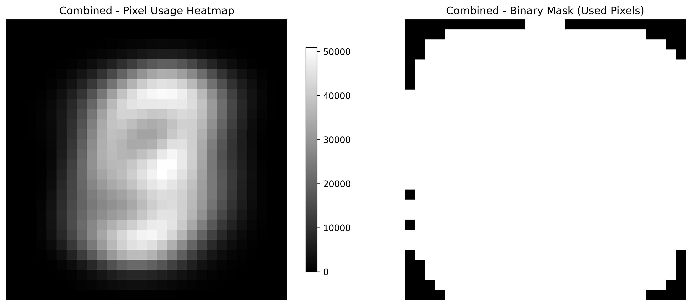
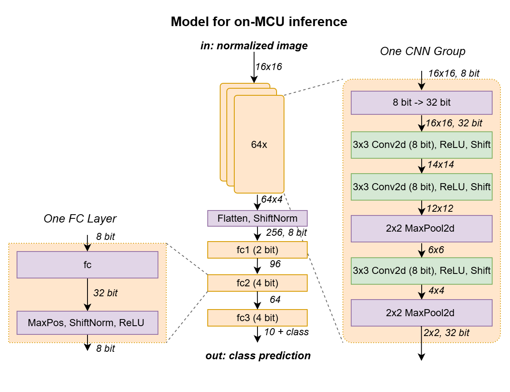
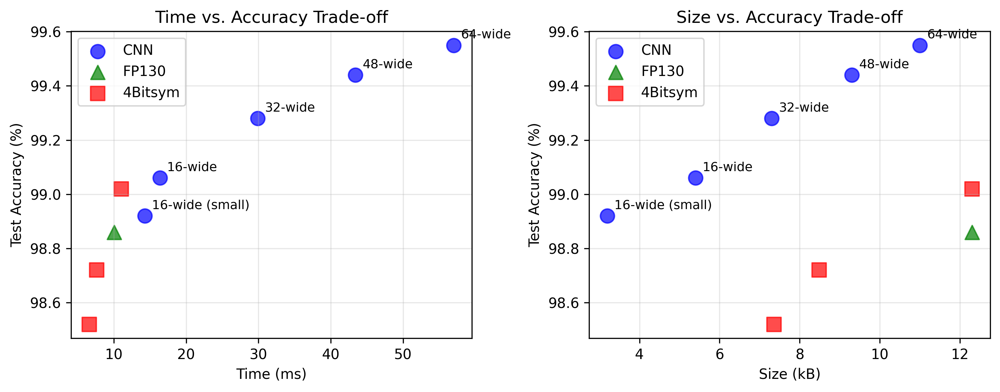

# BitNetMCU - CNN Implementation

**Beating 99.5% MNIST accuracy with Convolutional Neural Networks for Low-Bit Quantized Neural Networks on low-end 32 Bit Microcontrollers**

*T. S. Boescke, Aug 2024 - Sept 2025*

## Table of Contents
- [BitNetMCU - CNN Implementation](#bitnetmcu---cnn-implementation)
  - [Table of Contents](#table-of-contents)
  - [Introduction to CNN Implementation](#introduction-to-cnn-implementation)
  - [Convolutional Neural Networks](#convolutional-neural-networks)
  - [CNN Architecture Design](#cnn-architecture-design)
    - [Sequential Depthwise Convolution and In-Place Processing](#sequential-depthwise-convolution-and-in-place-processing)
    - [Simplifying Convolutions and Implementation](#simplifying-convolutions-and-implementation)
    - [Variable Quantization](#variable-quantization)
  - [CNN Implementation Results](#cnn-implementation-results)
    - [Performance Comparison](#performance-comparison)
    - [Inference Performance on MCU](#inference-performance-on-mcu)
- [References](#references)


## Introduction to CNN Implementation

This document details the implementation of Convolutional Neural Networks (CNNs) for the BitNetMCU project. The CNN implementation was developed to improve upon the fully connected (FC) model performance while maintaining compatibility with extremely limited low-end 32-bit microcontrollers.

While the work on the FC models focuses on quantization schemes that allow for multiplication-free inference, the CNN implementation leverages the hardware multipliers available in low-end RISC-V RV32EmC MCUs (e.g., CH32V002) and Cortex-M0 MCUs (e.g., STM32C0xx, PY32F0xx, MSPM0Cxxxx) to achieve higher accuracy.

The CNN implementation represents a significant advancement over the original fully connected approach, achieving **99.58% test accuracy** with a **0.42% error rate** - more than halving the error compared to the FC-only model.

## Convolutional Neural Networks 

[Convolutional Neural Networks](https://en.wikipedia.org/wiki/Convolutional_neural_network) are typically preferred for image processing over fully connected networks due to their superior performance. However, their implementation is more complex, which is why they were not included in the initial exploratory project.

All previous models were based on fully connected layers, which basically perform a matrix-vector multiplication, where a weight is reserved for each combination of input to output. This architecture is very effective at learning exact patterns; however, it does not possess any spatial awareness or inductive bias. It can learn a certain pattern at exactly one location, but will not recognize it if it is shifted by only one pixel.

CNNs are based on the idea of learning filter kernels that are convolved with the entire input image - the same filter is applied to all pixels of the same image. When the image is slightly shifted or otherwise distorted, the filter will still recognize the pattern. It is translation invariant.

Since the weights of a CNN are exposed to many different features within the same image, they can learn generalized features much more effectively. Additionally, they trade higher computational effort for a smaller memory footprint, as the weights are shared across the image.

Due to this, CNNs are vastly more powerful for image recognition tasks and were also the architecture that put machine learning on the map in the 1990s with [LeNet](https://en.wikipedia.org/wiki/LeNet)[^11]. CNNs also ended the "AI-Winter" by leading to the breakthrough in deep-learning image recognition with MCDNN[^12] and AlexNet[^13] in 2012.

But how do we implement them on a very limited low-end microcontroller? What is easy in PyTorch is not necessarily easy when doing it manually in C on a memory and compute limited device.

1) CNNs tend to increase the number of channels (feature maps) as progressing through the layers. Even for a 16x16 image, we need 512 or 1024 bytes per channel if we store them in parallel. This quickly exceeds the available RAM of only 3 or 4kB.

2) Convolutional layers are parameter efficient, but computationally very expensive. Every parameter in the kernel is multiplied with every pixel in the input image. This leads to a large number of operations, which can be easily parallelized on a GPU, but are very time consuming on a single-core MCU.

3) The convolution operation requires a lot of special case handling like padding, stride, and dilation. This makes the implementation more complex and increases code size.

## CNN Architecture Design

Following a lengthy "human-assisted architecture search", I settled on the following architecture:

<div align="center">
     
</div>

The first layer of the former fully connected model is replaced with convolutional layers that perform the function of extracting features from the input image.

### Sequential Depthwise Convolution and In-Place Processing

The implementation of the CNN layers is somewhat unusual. Typically, a CNN is evaluated layer-by-layer. However, when the number of channels is expanded, this results in quickly increasing memory requirements. For example, to store the activations of a 16x16 image with 32-bit precision and 64 channels, we would need 16×16×4×64B = 65,536B = 64kB of RAM, which exceeds the capabilities of the target device by far. In addition, performing convolutions across all channels requires a lot of computational power - 16×16×3×3×64×64 = 9,437,184 multiplications for just one layer.

To avoid this, a technique called depthwise separable convolutions has been introduced for architectures targeting mobile devices, prominently used in MobileNet[^14] and Xception[^15]. Here, the convolution is split into two separate operations: a depthwise convolution that operates on each channel separately and a pointwise operation that combines the outputs. This reduces the number of parameters and computations significantly. For the example above, the number of multiplications reduces to 16×16×3×3×64 + 16×16×64×64 = 1,196,032, which is significantly less.

We take this concept one step further and use sequential depthwise separated convolutions, where we perform 3 depthwise convolutions and maxpooling operations in sequence before combining the channels again.

<div align="center">
     
</div>

The image above shows the architecture of a single CNN channel. The input image is processed by three convolution layers with ReLU activation and two maxpooling layers. The output is a 2×2=4 element feature map. A total of 64 channels are processed and the resulting 64×4 = 256 values are then fed into the fully connected layers.

This approach has the advantage that each channel can be processed separately and only the 4 final activations need to be stored. In addition, we can use in-place processing[^16] where the output of each layer replaces the input data in the same memory array. This allows us to reduce the memory footprint of the convolution operations to that of a single channel: 16×16×4B = 1kB.

### Simplifying Convolutions and Implementation

Addressing the third point: To reduce complexity, I opted to go for the simplest possible conv2d operations: A 3×3 kernel with stride 1 and no padding. This allows for a greatly simplified implementation as no special case handling is required.

A potential issue is that patterns at the edge of the image cannot be detected well. However, as shown in the figure below, the edge pixels are almost never used in the MNIST dataset. (Left: Probability of each pixel being part of a digit in both the MNIST train and test set. Right: Black indicates pixels that are never used.)

<div align="center">
     
</div>

The code of the simplified convolution operation is shown below. It is unrolled for a 3×3 kernel and is fused with a ReLU activation function.

```c
int32_t* processconv33ReLU(int32_t *activations, const int8_t *weights, uint32_t xy_input, uint32_t n_shift, int32_t *output) {

    for (uint32_t i = 0; i < xy_input - 2; i++) {
        int32_t *row = activations + i * xy_input;
        for (uint32_t j = 0; j < xy_input - 2; j++) {
            int32_t sum = 0;
            int32_t *in = row++;

            // Unrolled convolution loop for 3x3 kernel
            sum += weights[0] * in[0] + weights[1] * in[1] + weights[2] * in[2];
            in += xy_input;
            sum += weights[3] * in[0] + weights[4] * in[1] + weights[5] * in[2];
            in += xy_input;
            sum += weights[6] * in[0] + weights[7] * in[1] + weights[8] * in[2];

            // Apply shift and ReLU
            if (sum < 0) {
                sum = 0;  // ReLU
            } else {
                sum = sum >> n_shift;
            }
            *output++ = (int32_t)sum;
        }
    }
    return output;
}
```

### Variable Quantization

The last piece of the puzzle was to use variable quantization. As shown in the full architecture diagram below, different quantization levels were used for weights and activations in different layers.

<div align="center">
     
</div>

The convolution layers turned out to be very sensitive to quantization. Better performing models degraded even for 4-bit weights. Luckily, the number of weights in the convolution layers is rather small, so there is little memory benefit in quantizing to below 8 bits.

However, the depthwise convolutions also turned out to be very sensitive to scaling errors in activations between the channels. In addition, to avoid mismatch between the channels, it was not possible to use normalization between the layers. I therefore opted to keep the activations in full 32-bit resolution and introduce fixed shifts to limit the dynamic range. Only after all channels are processed, quantization of activations to 8 bits and normalization is performed before feeding the data into the fully connected layers.

```
   Layer (type)        Output Shape      Param #      BPW    Bytes # 
======================================================================== 
    BitConv2d-1    [-1, 64, 14, 14]          576       8         576
    BitConv2d-3    [-1, 64, 12, 12]          576       8         576
    BitConv2d-6      [-1, 64, 4, 4]          576       8         576
   BitLinear-10            [-1, 96]       24,576       2       6,144
   BitLinear-12            [-1, 64]        6,144       4       3,072
   BitLinear-14            [-1, 10]          640       4         320
========================================================================
    Total                                 33,088              11,264 
```

The table above shows all learnable parameters in the model. The first fully connected layer is of size 256×96 and holds the most weights. To reduce memory, I scaled it down to 2-bit weights. Curiously, this did improve performance slightly compared to 4bpw, possibly due to regularization. The last two fully connected layers were kept at 4-bit weights. In total, the model consumes 11kB of flash memory for weights, which is less than needed for the fully connected model and leaves space for the additional inference code.

## CNN Implementation Results

### Performance Comparison

| Configuration | Width | BPW (fc1)| Epochs | Train Accuracy | Test Accuracy | Test Error | Model Size |
|---------------|-------|--------------|--------|----------------|---------------|------------|------------|
| 16-wide 2-bit | 16 | 2-bit | 60 | 98.43% | 99.06% | 0.94% | 42,880 bits (5.4 kB)
| 32-wide 2-bit | 32 | 2-bit | 60 | 99.12% | 99.28% | 0.72% | 58,624 bits (7.3 kB) |
| 48-wide 2-bit | 48 | 2-bit | 60 | 99.30% | 99.44% | 0.56% | 74,368 bits (9.3 kB) |
| 64-wide 2-bit | 64 | 2-bit | 60 | 99.40% | *99.53%* | *0.47%* | 90,112 bits (11.0 kB) |
| 64-wide 4-bit | 64 | 4-bit | 60 | 99.41% | 99.44% | 0.56% | 100,864 bits (12.3 kB) |
| 64-wide 2-bit (90ep) | 64 | 2-bit | 90 | 99.47% | **99.55%** | **0.45%** | 90,112 bits (11.0 kB) |
| 80-wide 2-bit (90ep) | 80 | 2-bit | 90 | 99.51% | 99.42% | 0.58% | 105,856 bits (13.2 kB) |

The table above shows the results of different optimization and ablation experiments. Key findings are:

- Quantizing the first fully connected layer to 2 bits vs. 4 bits improves the test performance slightly, possibly due to better regularization. This result is reproducible. Even introducing dropout at various levels did not improve performance of the 4-bit quantized model to that of the 2-bit model.
- Increasing the number of channels in the convolution layers improves train accuracy, as expected for a higher capacity model.
- The test accuracy is maximized for the 64-wide model and improves slightly with 90-epoch training.

A best result of 99.55% test accuracy (0.45% error) was achieved with the 64-wide, 2-bit model trained for 90 epochs. This represents a 0.5% improvement over the fully connected model and more than halves the test error.

Cross-validation between the quantized and exported 99.53% model was successful as shown below. Only two mismatches between the Python and C inference engines were found: The C version reduced mispredictions by one, most likely due to numeric differences in the normalization steps.

```
Verifying inference of quantized model in Python and C
  247 Mismatch between inference engines found. Prediction C: 6 Prediction Python: 2 True: 4
 3023 Mismatch between inference engines found. Prediction C: 8 Prediction Python: 5 True: 8
size of test data: 10000
Mispredictions C: 46 Py: 47
Overall accuracy C: 99.54 %
Overall accuracy Python: 99.53 %
Mismatches between engines: 2 (0.02%)
```

These results are notable, considering the constraints of using a 16×16 downsampled dataset, a strongly quantized model and limitations in total weight size and available memory during inference.

The error rate is still among the [state-of-the-art for CNN-based MNIST](https://en.wikipedia.org/wiki/MNIST_database) and qualifies for a top 100 position in the [ongoing Kaggle leaderboards](https://www.kaggle.com/c/digit-recognizer/leaderboard).

Pushing the model further proved difficult, as shown below. Walking further down the path of increasing model capacity by increasing the input width beyond 64 and using ternary weight quantization in fc1 for stronger regularization improved test loss, but did not improve accuracy significantly. Experiments with further data augmentation (elastic distortions, random erasing) did not improve the test error.

| Configuration             | Width | BPW (fc1) | Epochs | Train Accuracy | Test Accuracy | Test Loss  | Test Error | Model Size                 |
|---------------------------|-------|-----------|--------|----------------|---------------|------------|------------|---------------------------|
| 64-wide 2-bit             | 64    | 2-bit     | 60     | 99.40%         | 99.53%        | 0.016605   | 0.47%     | 90,112 bits (11.0 kB) |
| 80-wide ternary           | 80    | Ternary   | 60     | 99.46%         | 99.52%        | 0.016433   | 0.48%      | 93,568.0 bits (11.42 kB)  |
| 96-wide ternary           | 96    | Ternary   | 60     | 99.53%         | 99.58%        | 0.016243   | 0.42%      | 106,854.4 bits (13.04 kB) |
| 96-wide ternary (120 ep)  | 96    | Ternary   | 120    | 99.56%         | **99.58%**        | **0.014558**   | **0.42%**      | 106,854.4 bits (13.04 kB) |
| 96-wide tern. + elastic  | 96    | Ternary   | 120    | 99.10%         | 99.51%        | 0.014978   | 0.49%     | 106,854.4 bits (13.04 kB) |
| 128-wide ternary          | 128   | Ternary   | 60     | 99.51%         | 99.50%        | 0.015868   | 0.50%      | 133,427.2 bits (16.29 kB)

Neither did additional experiments (not shown) with a fully connected CNN architecture with more parameters and dropout. Increasing the input size to 28×28 also did not significantly improve performance. 
 
This suggests that the remaining mispredicted samples are far out of distribution for the given model. Possibly ensemble methods or a much higher capacity model coupled with a different regularization scheme would be required to push the error rate further down.

### Inference Performance on MCU

All performance data was collected on a CH32V002 microcontroller running at 48 MHz, 2 flash waitstates, inner loops executed from SRAM.

| Configuration | CNN Width | Size (kB) | Test Accuracy | Cycles Avg. | Time (ms) |
|---------------|-------|-----------|---------------|-------------|-----------|
| 16-wide CNN, small fc   | 16    | 3.2       | 98.92%        | 686,490     | 14.30     |
| 16-wide CNN   | 16    | 5.4       | 99.06%        | 785,123     | 16.36     |
| 32-wide CNN   | 32    | 7.3       | 99.28%        | 1,434,667   | 29.89     |
| 48-wide CNN   | 48    | 9.3       | 99.44%        | 2,083,568   | 43.41     |
| 64-wide CNN   | 64    | 11.0      | 99.55%        | 2,736,250   | 57.01     |
| 1k 2Bitsym FC   | -     | 1.1       | 94.22%        | 99,783      | 2.08      |
| 12k 4Bitsym FC  | -     | 12.3      | 99.02%        | 528,377     | 11.01     |
| 12k FP130 FC  | -     | 12.3      | 98.86%        | 481,624     | 10.03     |

The small fc CNN model reduces the hidden dimensions in the fc layers from 96/64 to 64/48 to significantly reduce parameter count. However, due to the CNN layers dominating the compute time, this only results in a small speedup.



The plot above shows the tradeoff between model size, accuracy and inference time. CNN based models clearly outperform in accuracy at the same parameter count. However, this comes at a steep increase in inference time. 

# References

[^11]: Y. LeCun et al. *Gradient-based learning applied to document recognition* ([Proc. IEEE, 1998](http://yann.lecun.com/exdb/publis/pdf/lecun-98.pdf))

[^12]: D. Cireşan et al. *Multi-column Deep Neural Networks for Image Classification* ([arXiv:1202.2745](https://arxiv.org/abs/1202.2745))

[^13]: A. Krizhevsky et al. *ImageNet Classification with Deep Convolutional Neural Networks* ([Proceedings of the 25th International Conference on Neural Information Processing Systems](https://proceedings.neurips.cc/paper_files/paper/2012/file/c399862d3b9d6b76c8436e924a68c45b-Paper.pdf)), Dec 2012

[^14]: A. G. Howard et al. *MobileNets: Efficient Convolutional Neural Networks for Mobile Vision Applications* ([arXiv:1704.04861](https://arxiv.org/abs/1704.04861))

[^15]: F. Chollet et al. *Xception: Deep Learning with Depthwise Separable Convolutions* ([arXiv:1610.02357](https://arxiv.org/abs/1610.02357))

[^16]: J. Lin et al. *MCUNet: Tiny Deep Learning on IoT Devices* ([arXiv:2007.10319](https://arxiv.org/abs/2007.10319))


[Document origin](https://github.com/cpldcpu/BitNetMCU/tree/main/docs) 