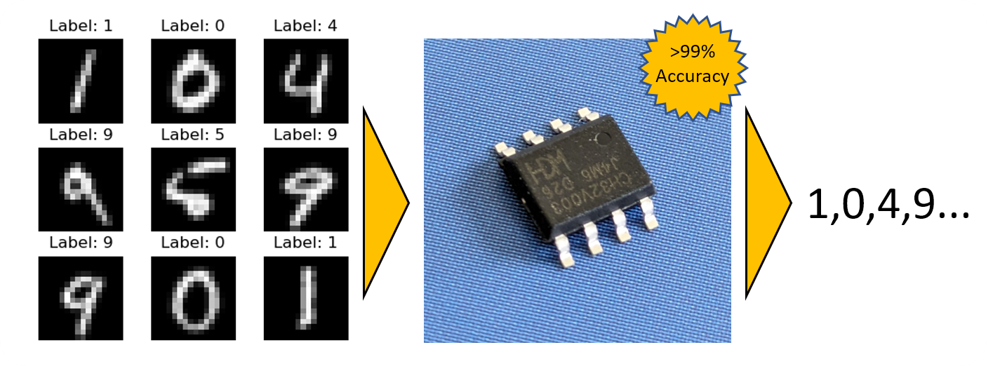

# BitNetMCU: High Accuracy Low-Bit Quantized Neural Networks on a low-end Microcontroller

**BitNetMCU** is a project focused on the training and inference of low-bit quantized neural networks, specifically designed to run efficiently on low-end microcontrollers like the CH32V003. Quantization aware training (QAT) and fine-tuning of model structure and inference code allowed *surpassing 99% Test accuracy on a 16x16 MNIST dataset without using multiplication instructions and in only 2kb of RAM and 16kb of Flash*.

The training pipeline is based on PyTorch and should run anywhere. The inference engine is implemented in Ansi-C and can be easily ported to any Microcontroller.

**You can find a detailed report on the project in the `docs/` directory [here](docs/documentation.md).**

<div align="center">
    
</div>

## Project Structure

```
BitNetMCU/
│
├── docs/                      # Report
├── mcu/                       # MCU specific code for CH32V003
├── modeldata/                 # Pre-trained models
│
├── BitNetMCU.py               # Pytorch model and QAT classes
├── BitNetMCU_inference.c      # C code for inference 
├── BitNetMCU_inference.h      # Header file for C inference code
├── BitNetMCU_MNIST_test.c     # Test script for MNIST dataset
├── BitNetMCU_MNIST_test_data.h# MNIST test data in header format (generated)
├── BitNetMCU_model.h          # Model data in C header format (generated)
├── exportquant.py             # Script to convert trained model to quantized format
├── test_inference.py          # Script to test C implementation of inference
├── training.py                # Training script for the neural network
└── trainingparameters.yaml    # Configuration file for training parameters
```

## Training Pipeline

The data pipeline is split into several Python scripts for flexibility:

1. **Configuration**: Modify `trainingparameters.yaml` to set all hyperparameters for training the model.

2. **Training the Model**: The `training.py` script is used to train the model and store the weights as a `.pth` file in the `modeldata/` folder. The model weights are still in float format at this stage, as they are quantized on-the-fly during training.

2. **Exporting the Quantized Model**: The `exportquant.py` script is used to convert the model into a quantized format. The quantized model weights are exported to the C header file `BitNetMCU_model.h`.

3. **Optional: Testing the C-Model**: Compile and execute `BitNetMCU_MNIST_test.c` to test inference of ten digits. The model data is included from `BitNetMCU_MNIST_test_data.h`, and the test data is included from the `BitNetMCU_MNIST_test_data.h` file. 

4. **Optional: Verification C vs Python Model on full dataset**: The inference code, along with the model data, is compiled into a DLL. The `test-inference.py` script calls the DLL and compares the results with the original Python model. This allows for an accurate comparison to the entire MNIST test data set of 10,000 images.

5. **Optional: Testing inference on the MCU**: follow the instructions in  `mcu/readme.md`. Porting to architectures other than CH32V003 is straightforward and the files in the `mcu` directory can serve as a reference.

## Updates

- 24th April 2024 - First release with Binary, Ternary, 2 bit, 4 bit and 8 bit quantization. 
- 2nd May 2024 - [tagged version 0.1a](https://github.com/cpldcpu/BitNetMCU/tree/0.1a)
- 8th May 2024 - Added FP1.3.0 Quantization to allow fully multiplication-free inference with 98.9% accuracy.
- 11th May 2024 - Fixes for Linux. Thanks to @donn
- 19th May 2024 - Add support for non-symmetric 4bit quantization scheme that allows for easier inference on MCUs with multiplier. The inference code will now use code optimized for multiplierless MCUs only on RV32 architectures without multiplier.
- 20th May 2024 - Added ```quantscale``` as a hyperparameter to influence weight scaling. [Updated documentation on new quantization schemes](https://github.com/cpldcpu/BitNetMCU/blob/main/docs/documentation.md#may-20-2024-additional-quantization-schemes).
- 26th May 2024 - [tagged version 0.2a](https://github.com/cpldcpu/BitNetMCU/tree/0.2a)
